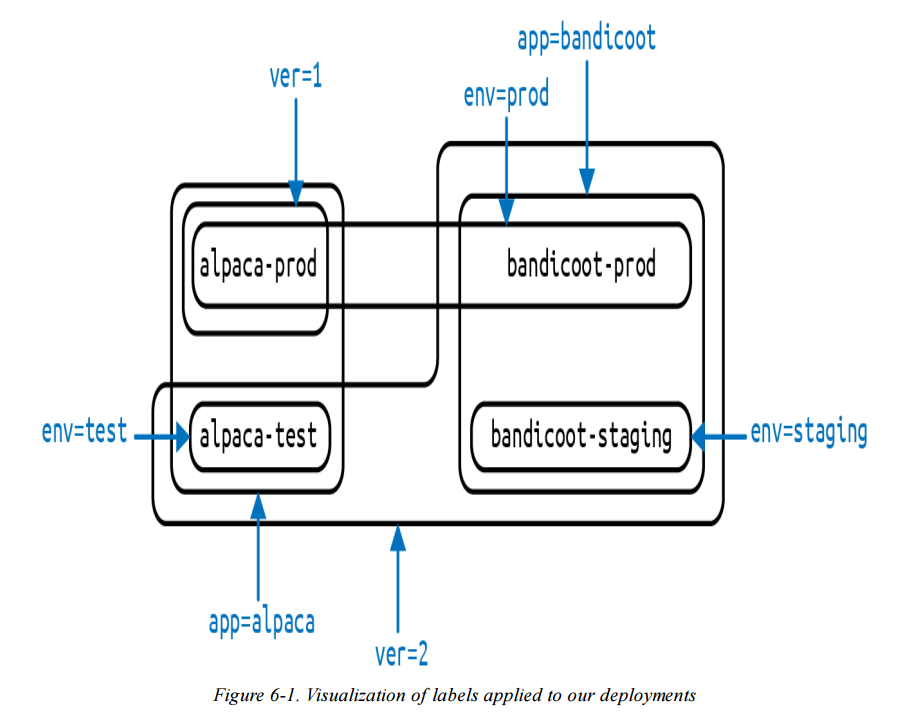

import InterviewQuestion from "@site/src/components/InterviewQuestion";

# Chapter 6: Labels and Annotations

:::note
Kubernetes uses labels and annotations to help manage applications as they scale in size and complexity.<br />
```Labels``` provide identifying key-value metadata that enables grouping and operating on sets of Kubernetes objects.<br />
```Annotations``` store non-identifying metadata for tools and integrations, but are not intended for querying or filtering resources.
:::

## Labels - Introduction
- **Labels: Purpose and Design Motivation**

  - **What Labels Are**
    - Labels provide **identifying metadata** for Kubernetes objects.
    - They represent **fundamental qualities** of an object.
    - Labels are used for:
      - **Grouping**
      - **Viewing**
      - **Operating** on sets of objects

  - **Why Labels Exist (Google’s Experience)**
    - Kubernetes label design comes from Google’s experience running
      **large-scale, complex production systems**.

- **Key Lessons Behind Labels**

  - **Production Abhors a Singleton**
    - Systems quickly scale from **one instance to many**.
    - Kubernetes is designed to operate on **sets of objects**, not individual instances.

  - **Rigid Hierarchies Don’t Scale**
    - Fixed system hierarchies fail as **relationships change over time**.
    - Labels allow resources to belong to **multiple logical groupings** simultaneously.

- **Label Syntax Overview**

  - Labels use **key/value pairs**
  - Both **key** and **value** are strings

- **Label Key Structure**

  - A label key consists of: **Optional prefix**, **Required name**
    - Format: `prefix/name`

  - **Prefix Rules**: Optional, Must be a **DNS subdomain**, Maximum length: **253 characters**

  - **Name Rules**: Required, Maximum length - **63 characters**
    - Must:
      - Start and end with an **alphanumeric character**
      - May contain:`-` (dash), `_` (underscore), `.` (dot)

- **Label Value Rules**

  - Label values are strings
  - Maximum length: **63 characters**
  - Must follow the **same character rules as label names**

```
apiVersion: v1
kind: Pod
metadata:
  name: my-app-pod
  labels:
    app: my-app
    acme.com/app-version: "1.0.0"
```

```
kubectl get pods -l acme.com/app-version=1.0.0
kubectl get pods -l app=my-app,version=1.0.0
```

## Labels – Applying Labels

- **Applying Labels to Deployments**

  - Deployments can be created with labels that describe key dimensions such as
    **application name**, **environment**, and **version**.
  - In this example, labels like `app`, `env`, and `ver` are applied at creation time
    to represent two applications (alpaca and bandicoot), multiple environments,
    and different versions.

```
$ kubectl run alpaca-prod \
  --image=gcr.io/kuar-demo/kuard-amd64:blue \
  --replicas=2 \
  --labels="ver=1,app=alpaca,env=prod"
```
```
$ kubectl run alpaca-test \
  --image=gcr.io/kuar-demo/kuard-amd64:green \
  --replicas=1 \
  --labels="ver=2,app=alpaca,env=test"
```
```
$ kubectl run bandicoot-prod \
  --image=gcr.io/kuar-demo/kuard-amd64:green \
  --replicas=2 \
  --labels="ver=2,app=bandicoot,env=prod"

$ kubectl run bandicoot-staging \
  --image=gcr.io/kuar-demo/kuard-amd64:green \
  --replicas=1 \
  --labels="ver=2,app=bandicoot,env=staging"
```
    

- **Why This Matters**

  - Labels enable Kubernetes to manage and reason about **groups of Pods**
    created by Deployments, rather than individual Pods.
  - By combining labels, resources can be selected and operated on based on
    **application**, **environment**, or **version**.

- **Resulting State**

  - After applying labels consistently, multiple Deployments can coexist in the cluster
    while remaining clearly distinguishable.
  - Commands like `kubectl get deployments --show-labels` make these logical
    groupings visible and verifiable.


---

## Labels – Modifying Labels and Selectors

- **Modifying Labels**
  - Labels can be added, updated, or removed after an object is created using `kubectl label`.
  - Applying a label to a **Deployment only affects the Deployment itself**, not the ReplicaSets or Pods created by the Deployment.
  - To change labels on Pods, the **Pod template inside the Deployment must be updated**.

```kubectl label deployments alpaca-test canary=true```

- Label values can be displayed as a column using the `-L` option.

```kubectl get deployments -L canary```

- A label can be removed by appending a dash (`-`) to the label key.

```kubectl label deployments alpaca-test canary-```

---

- **Label Selectors**
  - Label selectors filter Kubernetes objects based on **Boolean expressions over labels**.
  - Selectors are used by both users (`kubectl`) and controllers such as ReplicaSets.

```kubectl get pods --show-labels```

- Select objects where a label equals a value.

```kubectl get pods --selector="ver=2"```

- Multiple selectors separated by commas represent a **logical AND**.

```kubectl get pods --selector="app=bandicoot,ver=2"```

- Select objects where a label matches one of several values.

```kubectl get pods --selector="app in (alpaca,bandicoot)"```

- Select objects where a label key exists.

```kubectl get deployments --selector="canary"```

- Selector operators:
  - key=value        : key is set to value
  - key!=value       : key is not set to value
  - key in (v1,v2)   : key is one of v1 or v2
  - key notin (v1,v2): key is not one of v1 or v2
  - key              : key exists
  - !key             : key does not exist

```kubectl get deployments --selector='!canary'```

```kubectl get pods -l 'ver=2,!canary'```

---

## Labels – Label Selectors in API Objects

- **Label Selectors in API Objects**
  - Kubernetes objects use **label selectors** to refer to a set of other Kubernetes objects.
  - In API objects, selectors are defined as **structured fields**, not simple strings.
  - For historical reasons, Kubernetes supports **two selector forms**:
    - A newer, more expressive form
    - An older, simpler form (for backward compatibility)

- **New Selector Form (matchLabels + matchExpressions)**
  - Most modern Kubernetes objects support this form.
  - A selector like `app=alpaca,ver in (1,2)` is represented as:

```
selector:
  matchLabels:
    app: alpaca
  matchExpressions:
    - {key: ver, operator: In, values: [1, 2]}
```

  - matchLabels represents simple equality checks.
  - matchExpressions supports advanced operators such as `In` and `NotIn`.
  - All selector terms are evaluated using **logical AND**.
  - The `!=` operator is internally represented as a `NotIn` expression with a single value.

- **Older Selector Form**
  - Used by older resources such as ReplicationControllers and some Services.
  - Only supports the `=` operator.
  - All key/value pairs must match exactly.

```
selector:
  app: alpaca
  ver: "1"
```
Equal to in Deployment / ReplicaSet
```
selector:
  matchLabels:
    app: alpaca
    ver: "1"
```

P.S.
```
你 (kubectl / YAML)
   ↓
Kubernetes API (control plane)
   ↓
Controllers（Deployment / ReplicaSet / Scheduler）
   ↓
Pods 被建立、排程到 Nodes
   ↓
CNI 建立網路
   ↓
Pods 跨 Node 溝通（data plane）
```

```
你的電腦裡
└── VM / Docker container
    └── Kubernetes
        ├── API Server（server）
        ├── Scheduler
        ├── Controllers
        └── Nodes（跑 Pods）
```

- **Labels in the Kubernetes Architecture**
  - Kubernetes is a **decoupled system** with no fixed hierarchy.
  - Relationships between objects are defined using **labels and selectors**, not hard references.

- **Common Uses of Labels and Selectors**
  - ReplicaSets use selectors to find and manage their Pods.
  - Services use selectors to determine which Pods receive traffic.
  - Pods use node selectors to choose which nodes they can be scheduled on.
  - Network Policies use labels to control which Pods are allowed to communicate.

- **Key Takeaway**
  - Labels and label selectors act as the **glue** that connects Kubernetes objects.
  - As applications grow, label usage typically becomes more complex and expressive over time.


---

## Annotations – Purpose and Usage

- **What Annotations Are**
  - Annotations provide a place to store **additional metadata** for Kubernetes objects.
  - They are designed to **assist tools and libraries**, not for identifying or grouping objects.
  - Annotations store **opaque data** that Kubernetes itself does not interpret.
  - They are often used by external systems interacting with Kubernetes via the API.

- **Labels vs Annotations**
  - **Labels** are used to:
    - Identify objects
    - Group objects
    - Select objects (via selectors)
  - **Annotations** are used to:
    - Attach extra information
    - Describe origin, usage, or policy
    - Support tooling and automation
  - When in doubt:
    - Store metadata as an **annotation**
    - Promote it to a **label** only if it is needed for selection

- **Common Uses of Annotations**
  - Record the **reason for the latest update** to an object.
  - Pass **special scheduling policies** to custom schedulers.
  - Track which **tool last updated** a resource and how it was updated.
  - Attach **build or release metadata** such as:
    - Git commit hash

```
...
metadata:
  annotations:
    example.com/icon-url: "https://example.com/icon.png"
...
```

---

## Cleanup – Removing Deployments

- **Cleaning Up Resources**
  - All Deployments created in this chapter can be removed at once using:

```kubectl delete deployments --all```

- **Selective Cleanup**
  - The `--selector` flag can be used to delete only Deployments that match specific labels.
  - This allows more controlled cleanup instead of deleting everything.

```kubectl delete deployments --selector="env=test"```

---