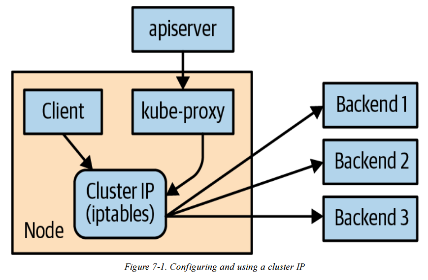
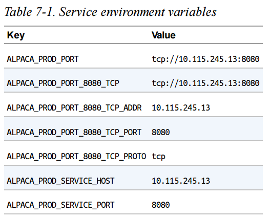

import InterviewQuestion from "@site/src/components/InterviewQuestion";

# Chapter 7. Service Discovery

:::note
Kubernetes is a highly dynamic system where Pods are constantly created, destroyed, moved, and rescheduled.<br />
This flexibility makes it easy to scale and automate applications, but it also creates a challenge:
**how do components reliably find each other in such a changing environment?**<br />
Chapter 7 focuses on **Service Discovery**, which provides stable mechanisms for locating and connecting to application components even as Pods and nodes change over time.
:::

Review:
```
Deployment（我要跑幾個、怎麼更新）
 └── ReplicaSet（確保數量正確）
      └── Pod（跑程式的最小單位）
           └── Container（你的 app）

Service（穩定入口 / 門牌）
 └── 指向一群 Pods（用 labels）

Node（機器）
 └── 跑 Pods
```
```
Node：通常先存在（雲端或本機已準備好）
↓
你寫 Deployment（你真正「建立」的東西）
↓
Deployment 建 Pod（你不用手動）
↓
Scheduler 把 Pod 放到 Node
↓
Service 提供穩定連線入口
```
Kind 架構
```
1️⃣ 用 Docker containers 假裝多台機器（Nodes）
2️⃣ 在這些 Nodes 裡跑 Kubernetes
3️⃣ Kubernetes 再在 Nodes 裡跑 Pods
4️⃣ Pods 裡跑你的 containers
```
## Service Discovery – Introduction

- **What Is Service Discovery**
  - Service discovery refers to the set of problems and solutions related to
    **finding which processes are listening on which addresses for which services**.
  - A service-discovery system helps clients locate services **quickly and reliably**.

- **Characteristics of a Good Service-Discovery System**
  - **Low latency**: clients are updated quickly when service information changes.
  - **Reliability**: clients can consistently find the correct service endpoints.
  - **Rich service definitions**: services may expose multiple ports or additional metadata.

- **DNS as Traditional Service Discovery**
  - DNS is the traditional service-discovery mechanism on the internet.
  - It is designed for **stable environments** with aggressive caching.
  - DNS works well for the internet, but is **not well suited for highly dynamic systems**
    like Kubernetes.

```api.example.com → 1.2.3.4```

- **Limitations of DNS in Dynamic Environments**
  - Many clients (for example, Java by default) **resolve DNS once and cache forever**.
  - Even with short TTLs, there is an unavoidable delay before clients see updates.
  - DNS responses are limited in:
    - Amount of information
    - Number of IP addresses returned
  - DNS A records often break down beyond **20–30 IP addresses**.
  - SRV records solve some issues but are **difficult to use in practice**.

- **DNS Load Balancing Limitations**
  - Clients typically select the **first IP address** returned by DNS.
  - DNS relies on record order randomization or round-robin behavior.
  - This approach is **not a substitute for purpose-built load balancing**.

- **Key Takeaway**
  - Traditional DNS-based discovery is insufficient for Kubernetes’
    **frequently changing, highly dynamic service landscape**.
  - Kubernetes requires a more specialized service-discovery mechanism.

    

## The Service Object

- **Service as the Foundation of Service Discovery**
  - Real service discovery in Kubernetes begins with the **Service object**.
  - A Service is essentially a **named label selector**.
  - It groups a set of Pods and provides a stable way to access them.
  - In addition to discovery, Services also provide networking and load-balancing features.

- **Service Creation with kubectl expose**
  - Just as `kubectl run` (or create deployment) is a convenient way to create Deployments,
    `kubectl expose` is a convenient way to create a Service.
  - For now, a Deployment can be thought of as an instance of a **microservice**.

- **Creating Deployments**

```
$ kubectl create deployment alpaca-prod \
  --image=gcr.io/kuar-demo/kuard-amd64:blue \
  --port=8080

$ kubectl scale deployment alpaca-prod --replicas 3

$ kubectl create deployment bandicoot-prod \
  --image=gcr.io/kuar-demo/kuard-amd64:green \
  --port=8080

$ kubectl scale deployment bandicoot-prod --replicas 2

```
- **Exposing Deployments as Services**
  - `kubectl expose` creates a Service from an existing Deployment.
  - It automatically extracts:
    - The **label selector**
    - The **relevant ports** (8080 in this example)

```
$ kubectl expose deployment alpaca-prod
$ kubectl expose deployment bandicoot-prod
```

- **Listing Services**

```
$ kubectl get services -o wide

NAME             CLUSTER-IP        PORT(S)     SELECTOR
alpaca-prod      10.115.245.13     8080/TCP    app=alpaca
bandicoot-prod   10.115.242.3      8080/TCP    app=bandicoot
kubernetes       10.115.240.1      443/TCP     <none>
```

- **Built-in kubernetes Service**
  - The `kubernetes` Service is created automatically.
  - It allows applications running inside the cluster to locate and communicate
    with the Kubernetes API server.

- **Selectors and ClusterIP**
  - The SELECTOR column shows which Pods each Service targets.
  - Each Service is assigned a **ClusterIP**, which is a virtual IP address.
  - Traffic sent to the ClusterIP is **load balanced** across all Pods
    that match the selector.

- **Interacting with a Service Using Port Forwarding**
  - Port forwarding allows local access to a Pod for testing or debugging.

```
$ ALPACA_POD=$(kubectl get pods -l app=alpaca \
  -o jsonpath='{.items[0].metadata.name}')

$ kubectl port-forward $ALPACA_POD 48858:8080
```

- **Key Takeaway**
  - A Service provides a **stable network endpoint** for a dynamic set of Pods.
  - Clients interact with the Service, not individual Pod IPs.

---

## Service DNS

- **Stable DNS for Services**
  - Each Service is assigned a stable **ClusterIP**, which makes it suitable to be
    associated with a DNS name.
  - Because the ClusterIP does not change, problems caused by DNS caching are
    largely avoided.

- **Kubernetes DNS Service**
  - Kubernetes provides an internal DNS service to all Pods in the cluster.
  - This DNS service is installed as a **system component** when the cluster is created.
  - The DNS service itself is managed by Kubernetes and runs inside the cluster.
  - It maps **Service names to their corresponding ClusterIPs**.

- **Service DNS Records**
  - Each Service receives a DNS A record that resolves to its ClusterIP.
  - Example DNS query result:

```alpaca-prod.default.svc.cluster.local  →  10.115.245.13```

- **Service DNS Name Structure**
  - `alpaca-prod` : Service name
  - `default`     : Namespace
  - `svc`         : Indicates the object is a Service
  - `cluster.local` : Cluster’s base domain (configurable by administrators)

- **Using Service Names**
  - Within the same namespace, a Service can be accessed using just its name
    (e.g., `alpaca-prod`).
  - Services in other namespaces can be accessed using
    `service-name.namespace`.
  - The fully qualified domain name (FQDN) can also be used:
    `service-name.namespace.svc.cluster.local`.

- **Key Takeaway**
  - Kubernetes DNS enables reliable service discovery by providing stable,
    name-based access to Services, independent of Pod IP changes.


---

## Readiness Checks

- **Purpose of Readiness Checks**
  - When a Pod first starts, it may not be ready to handle traffic due to initialization.
  - A readiness check allows Kubernetes to determine **when a Pod is ready to receive requests**.
  - Services only send traffic to Pods that are marked as **ready**.
  - P.S. If there is no **readinessProbe** settings, that pod will always be thought *ready*.

- **Configuring a Readiness Probe**
  - Readiness checks are defined at the **Pod level** inside the Deployment’s Pod template.
  - In this example, an HTTP readiness probe is added to the alpaca-prod Deployment.

```
readinessProbe:
  httpGet:
    path: /ready
    port: 8080
  periodSeconds: 2
  initialDelaySeconds: 0
  failureThreshold: 3
  successThreshold: 1
```
Review:

```
apiVersion: apps/v1
kind: Deployment
metadata:
  name: alpaca-prod
spec:
  replicas: 3
  selector:
    matchLabels:
      app: alpaca
  template:
    metadata:
      labels:
        app: alpaca
    spec:
      containers:
      - name: alpaca-prod
        image: gcr.io/kuar-demo/kuard-amd64:blue
        ports:
        - containerPort: 8080
        readinessProbe:
          httpGet:
            path: /ready
            port: 8080
          periodSeconds: 2
          initialDelaySeconds: 0
          failureThreshold: 3
          successThreshold: 1
```

- **How the Readiness Probe Works**
  - Kubernetes sends an HTTP GET request to `/ready` on port 8080.
  - The check runs every 2 seconds.
  - After 3 consecutive failures, the Pod is marked **NotReady**.
  - After 1 successful check, the Pod is marked **Ready** again.

- **Effect on Traffic Routing**
  - Only Pods in the **Ready** state are included in a Service’s endpoints.
  - When a Pod becomes NotReady, it is automatically removed from the Service’s endpoint list.
  - When it becomes Ready again, it is added back.

- **Observing Readiness Behavior**
  - Updating the Deployment causes Pods to be recreated.
  - Port forwarding must be restarted after Pods are recreated.
  - The `kubectl get endpoints --watch` command can be used to observe
    how Pods are added to or removed from a Service in real time.

- **Operational Benefits**
  - Readiness checks allow unhealthy or overloaded Pods to stop receiving traffic.
  - They support **graceful shutdown** by letting a Pod finish existing requests
    before being removed from service.

- **Key Takeaway**
  - Readiness checks give Kubernetes a safe and automatic way to control
    which Pods receive traffic, improving reliability and stability.


---

## Looking Beyond the Cluster

- **Problem: Exposing Services Outside the Cluster**
  - So far, services have only been reachable **inside the Kubernetes cluster**.
  - Pod IPs are typically **internal-only** and cannot be accessed from outside.
  - To accept external traffic, Kubernetes needs an exposure mechanism.

```
外部流量
  ↓
任何一台 Node 的 IP:NodePort
  ↓
Service
  ↓
Pods（負責實際處理）
```

- **NodePort: Extending a Service Outside the Cluster**
  - A **NodePort Service** extends a normal Service.
  - In addition to a **ClusterIP**, Kubernetes:
    - Chooses a port (or uses one specified by the user)
    - Opens that port on **every Node** in the cluster
  - Traffic sent to:
    - `<any-node-ip>:<nodePort>`
    - is forwarded to the Service
    - then load-balanced to matching Pods

Edit the yaml of service alpaca-prod
```
$ kubectl edit service alpaca-prod
```

```
type: ClusterIP
⬇️ 改成
type: NodePort
```
  - Kubernetes automatically assigns a NodePort
    - Typically in the range **30000–32767**

```
$ kubectl describe service alpaca-prod

Name: alpaca-prod
Namespace: default
Labels: app=alpaca
Annotations: <none>
Selector: app=alpaca
Type: NodePort
IP: 10.115.245.13
Port: <unset> 8080/TCP
NodePort: <unset> 32711/TCP
Endpoints: 10.112.1.66:8080,10.112.2.104:8080,10.112.2.105:8080
Session Affinity: None
No events.
```

- **What kubectl describe service Shows**
  - Service type: `NodePort`
  - ClusterIP: internal virtual IP
  - NodePort: externally reachable port on every Node
  - Endpoints: Pod IPs and ports that receive traffic

- **Accessing the Service**
  - Direct access:
    - `<node-ip>:<nodePort>`
  - SSH tunneling example(If it is cloud):
    - Forward local port to NodePort
    - Access service via `http://localhost:<local-port>`

```$ ssh <node> -L 8080:localhost:32711```

- **Load Balancing Behavior**
  - Each request to the NodePort:
    - Is randomly routed to one of the Pods
    - Provides basic load balancing
  - Reloading the page may hit different Pods each time

- **Key Takeaway**
  - **NodePort exposes a Service on every Node**
  - It provides a simple, portable way to allow external traffic
  - Clients interact with Nodes, not Pods
  - Kubernetes handles routing and load balancing automatically

---

## Load Balancer Integration

```
ClusterIP   → 只能 cluster 內用
NodePort    → 可以從 Node 進來
LoadBalancer → 給整個網路 / 網際網路用
```

- **LoadBalancer Service Type**
  - `LoadBalancer` builds on top of **NodePort**.
  - In addition to creating:
    - a ClusterIP
    - a NodePort
  - Kubernetes also asks the **cloud provider** to:
    - create an external load balancer
    - route traffic from that load balancer to the Nodes in the cluster

- **How It Works**
  - Client traffic flow:
    - External Load Balancer (public IP or hostname)
    - → NodePort on cluster Nodes
    - → Service (ClusterIP)
    - → matching Pods
  - Most managed Kubernetes services (GKE, EKS, AKS) support this automatically.

- **Creating a LoadBalancer Service**
  - Edit an existing Service:
    - Set `spec.type: LoadBalancer`
  - Kubernetes will:
    - provision a cloud load balancer
    - assign an **EXTERNAL-IP** (or hostname)
  - The EXTERNAL-IP may initially show `<pending>` while the cloud resource is created.

```
$ kubectl edit service alpaca-prod

type: ClusterIP
⬇️ 改成
type: LoadBalancer
```

```
$ kubectl describe service alpaca-prod

Name: alpaca-prod
Namespace: default
Labels: app=alpaca
Selector: app=alpaca
Type: LoadBalancer
IP: 10.115.245.13
LoadBalancer Ingress: 104.196.248.204
Port: <unset> 8080/TCP
NodePort: <unset> 32711/TCP
Endpoints: 10.112.1.66:8080,10.112.2.104:8080,10.112.2.105:8080
Session Affinity: None
Events:
  FirstSeen ... Reason Message
  --------- ... ------ -------
  3m ... Type NodePort -> LoadBalancer
  3m ... CreatingLoadBalancer Creating load balancer
  2m ... CreatedLoadBalancer Created load balancer
```

```
EXTERNAL-IP: 104.196.248.204
http://104.196.248.204:8080
```

- **kubectl describe service Output**
  - Shows:
    - ClusterIP (internal virtual IP)
    - NodePort (still exists underneath)
    - LoadBalancer Ingress (public IP or DNS name)
    - Endpoints (Pod IPs receiving traffic)
  - Events indicate:
    - transition from NodePort → LoadBalancer
    - creation of the cloud load balancer

- **Security Warning**
  - A Service of type `LoadBalancer` is **publicly accessible by default**.
  - Only use this for services that are safe to expose to the internet.
  - Additional security considerations are required (firewalls, auth, TLS).

- **Cloud-Specific Behavior**
  - Load balancer implementation depends on the cloud provider.
  - Some clouds return:
    - an IP address (e.g., GCP)
    - a DNS hostname (e.g., AWS ELB)
  - Provisioning may take several minutes.

- **Internal Load Balancers**
  - Sometimes services should be exposed **only inside a private network**.
  - This is done via **Service annotations** (cloud-specific).
  - Examples:
    - Azure:
      service.beta.kubernetes.io/azure-load-balancer-internal: "true"
    - AWS:
      service.beta.kubernetes.io/aws-load-balancer-internal: "true"
    - Alibaba Cloud:
      service.beta.kubernetes.io/alibaba-cloud-loadbalancer-address-type: "intranet"
    - Google Cloud:
      cloud.google.com/load-balancer-type: "Internal"

- **Example Internal LoadBalancer Configuration**
  - Add an annotation to the Service metadata(Service YAML):

```
...
metadata:
  name: some-service
  annotations:
    service.beta.kubernetes.io/azure-load-balancer-internal: "true"
...
```
Review
```
需求                  正確選擇
--------------------  --------------------------
只給 cluster 內用     ClusterIP
對外公開              LoadBalancer / Ingress
內網但非 cluster      Internal LoadBalancer
教學 / 測試           NodePort
```

- **Key Takeaways**
  - `LoadBalancer` is the most convenient way to expose services externally.
  - It relies heavily on cloud-provider integration.
  - Annotations are used to extend or customize load balancer behavior.
  - NodePort and ClusterIP still exist underneath the LoadBalancer abstraction.

---

## Advanced Details – Endpoints

- **Why Endpoints Exist**
  - Kubernetes is designed to be **extensible** and support advanced integrations.
  - Some applications need to discover service backends **without using a ClusterIP**.
  - For this purpose, Kubernetes provides a separate object called **Endpoints**.

- **What Is an Endpoints Object**
  - For every Service, Kubernetes automatically creates a corresponding **Endpoints object**.
  - The Endpoints object contains:
    - The **actual Pod IP addresses**
    - The **ports** those Pods are listening on
  - It represents the **real, current backends** for a Service.

```
$ kubectl describe endpoints alpaca-prod

  Name: alpaca-prod
  Namespace: default
  Labels: app=alpaca
  Subsets:
  Addresses: 10.112.1.54,10.112.2.84,10.112.2.85
  NotReadyAddresses: <none>
  Ports:
  Name Port Protocol
  ---- ---- --------
  <unset> 8080 TCP
  No events.
```

- **Relationship Between Service and Endpoints**
  - Service:
    - Defines *which Pods* belong together (via selectors)
    - Provides a stable abstraction
  - Endpoints:
    - Lists the *current IPs* of Pods matching the Service selector
    - Updates dynamically as Pods are added, removed, or replaced

- **Watching Endpoints Changes**

```
$ kubectl get endpoints alpaca-prod --watch

  NAME ENDPOINTS AGE
  alpaca-prod 10.112.1.54:8080,10.112.2.84:8080,10.112.2.85:8080 1m
```
Another Terminal:
```
$ kubectl delete deployment alpaca-prod
$ kubectl create deployment alpaca-prod \
--image=gcr.io/kuar-demo/kuard-amd64:blue \
--port=8080
$ kubectl scale deployment alpaca-prod --replicas=3
```
Go back:
```
  NAME ENDPOINTS AGE
  alpaca-prod 10.112.1.54:8080,10.112.2.84:8080,10.112.2.85:8080 1m
  alpaca-prod 10.112.1.54:8080,10.112.2.84:8080 1m
  alpaca-prod <none> 1m
  alpaca-prod 10.112.2.90:8080 1m
  alpaca-prod 10.112.1.57:8080,10.112.2.90:8080 1m
  alpaca-prod 10.112.0.28:8080,10.112.1.57:8080,10.112.2.90:8080 1m
```

- **Why This Matters**
  - Endpoints provide **low-level service discovery** based on real Pod IPs.
  - Advanced clients can:
    - Query the Kubernetes API directly
    - Watch for endpoint changes
    - Perform their own load balancing or routing

- **Limitations**
  - Most existing applications are not designed to:
    - watch APIs
    - handle rapidly changing IP addresses
  - These applications typically expect **stable IPs or DNS names**.

- **Key Takeaway**
  - Services offer a stable abstraction.
  - Endpoints expose the dynamic reality behind that abstraction.
  - Endpoints are powerful for Kubernetes-native applications, but less suitable for legacy systems.

---

## Advanced Details – Manual Service Discovery

- **Core Idea**
  - Kubernetes Services are built on top of **label selectors over Pods**.
  - Because of this, it is possible to perform **basic service discovery manually**
    using the Kubernetes API or `kubectl`, without creating a Service object.

- **Listing Pods with IPs**

```
$ kubectl get pods -o wide --show-labels

  NAME ... IP ... LABELS
  alpaca-prod-12334-87f8h ... 10.112.1.54 ... app=alpaca
  alpaca-prod-12334-jssmh ... 10.112.2.84 ... app=alpaca
  alpaca-prod-12334-tjp56 ... 10.112.2.85 ... app=alpaca
  bandicoot-prod-5678-sbxzl ... 10.112.1.55 ... app=bandicoot
  bandicoot-prod-5678-x0dh8 ... 10.112.2.86 ... app=bandicoot
```

- **Filtering Pods with Labels**

```
$ kubectl get pods -o wide --selector=app=alpaca

  NAME ... IP ...
  alpaca-prod-3408831585-bpzdz ... 10.112.1.54 ...
  alpaca-prod-3408831585-kncwt ... 10.112.2.84 ...
  alpaca-prod-3408831585-l9fsq ... 10.112.2.85 ...
```

- **What This Gives You**
  - You now know:
    - Which Pods belong to an application
    - The exact IP addresses to contact
  - This is the **most basic form of service discovery**.

- **Limitations**
  - Pod IPs are **ephemeral** and change as Pods are recreated.
  - Clients must:
    - Re-query Kubernetes frequently
    - Correctly maintain and apply consistent labels
  - Keeping label usage synchronized across systems is **error-prone**.

- **Why Services Exist**
  - The Service object was created to:
    - Encapsulate label selectors
    - Provide a **stable abstraction** over changing Pod IPs
    - Remove the burden of manual discovery from applications

---

## Advanced Details – kube-proxy and Cluster IPs

- **Cluster IPs**
  - A Cluster IP is a **stable virtual IP**
  - It is used to **load balance traffic**
    across all Pod endpoints behind a Service
  - A Cluster IP is **not a real IP** assigned to any Node or Pod

    

```
Service (ClusterIP: 10.115.245.13)
  selector: app=alpaca
        ↓
Pod A (10.112.1.54)
Pod B (10.112.2.84)
Pod C (10.112.2.85)
```

- **Role of kube-proxy**
  - kube-proxy is a component that runs on **every Node**
  - It watches Services and Endpoints via the **Kubernetes API Server**
  - kube-proxy programs **iptables rules** in the Node’s kernel
    to rewrite packet destinations
  - Traffic sent to a Cluster IP is redirected to
    one of the Service’s Pod endpoints

- **Dynamic Updates**
  - When:
    - Pods are added or removed
    - Pod readiness checks fail or recover
  - kube-proxy automatically updates iptables rules
  - This ensures traffic is only sent to **currently ready Pods**

- **Cluster IP Assignment**
  - Cluster IPs are typically assigned automatically
    by the API Server when a Service is created
  - Users may optionally specify a Cluster IP
  - Once assigned, a Cluster IP **cannot be changed**
    without deleting and recreating the Service

```
Internet
   |
   v
Cloud Load Balancer (L4 / L7)        ← 雲端供應商（GCP / AWS / Azure）
   |
   v
NodeIP : NodePort                   ← 每一台 Node 都開同一個 NodePort
   |
   v
Service (ClusterIP, 虛擬 IP)         ← Kubernetes Service
   ^
   |
service-name (DNS)
   |
   v
kube-proxy (iptables / ipvs)        ← 真正做 Load Balancing 的地方
   |
   v
Pod A        Pod B        Pod C      ← 實際跑應用程式的 Pods
```

- **Service IP Range**
  - Cluster IPs are allocated from a predefined Service IP range
  - This range is configured on the API server using:
    --service-cluster-ip-range
  - The Service IP range must:
    - Not overlap with Node or Docker bridge IP ranges
    - Contain any manually requested Cluster IPs
      that are not already in use

---

## Advanced Details – Cluster IP Environment Variables(replaced by DNS)

- **What This Is**
  - Kubernetes can inject **Service information as environment variables**
    into Pods when they start.
  - This is an **older service discovery mechanism**, largely replaced by DNS.

- **How It Works**
  - When a Pod starts, Kubernetes automatically adds environment variables
    for each Service in the same namespace.
  - These variables contain the Service’s **ClusterIP and port**.

```
$ BANDICOOT_POD=$(kubectl get pods -l app=bandicoot \
-o jsonpath='{.items[0].metadata.name}')
$ kubectl port-forward $BANDICOOT_POD 48858:8080
```
Go to http://localhost:48858:
    

- **How Applications Use It**
  - Applications can connect to a Service using:
    - SERVICE_HOST
    - SERVICE_PORT
  - No DNS lookup is required.

- **Limitations**
  - **Creation order matters**:
    - Services must exist *before* Pods start
    - Otherwise, environment variables will not be injected
  - Makes deployments more complex for large systems
  - Less flexible and harder to reason about than DNS

- **Key Takeaway**
  - Environment variables for Services still exist for legacy reasons
  - **DNS-based service discovery is preferred**
    because it is dynamic, order-independent, and easier to manage

---

## Connecting to Resources Outside of a Cluster

- **Why This Is Needed**
  - Real-world systems often mix:
    - Kubernetes-based (cloud-native) applications
    - Legacy or on-premise applications
  - Kubernetes must sometimes connect to services
    that live **outside the cluster**
  - This area is still evolving and has multiple patterns

- **Selector-less Services**
  - Kubernetes can create a Service **without a selector**
  - This allows Kubernetes DNS to work normally
    while traffic is sent to an **external IP**

- **How It Works**
  - Remove `spec.selector` from the Service
  - Kubernetes will:
    - Create the Service
    - NOT automatically create Endpoints
  - You must manually define an **Endpoints object**

Example: External Database Service
```
apiVersion: v1
kind: Service
metadata:
  name: my-database-server
spec:
  ports:
    - port: 1433
```

- **Manual Endpoints**
  - Endpoints contain fixed IP addresses
    (e.g., an on-prem database or legacy server)
  - Usually added once if the IP is stable
  - Must be updated manually if the IP changes

```
apiVersion: v1
  kind: Endpoints
  metadata:
    # This name must match the name of your service
    name: my-database-server
  subsets:
    - addresses:
      # Replace this IP with the real IP of your server
      - ip: 1.2.3.4
    ports:
      # Replace this port with the port(s) you want to expose
      - port: 1433
```

- **Result**
  - Pods can access the external resource using:
    - Service DNS name (e.g. `my-database-server`)
  - Kubernetes handles discovery
  - Network traffic flows outside the cluster

Review normal service yaml:
```
apiVersion: v1
kind: Service
metadata:
  name: alpaca-prod
spec:
  type: ClusterIP          # 預設就是 ClusterIP
  selector:                # 🔹 關鍵差異：有 selector
    app: alpaca             # 會選到 labels app=alpaca 的 Pods
  ports:
    - name: http
      port: 8080            # Service 對外（cluster 內）暴露的 port
      targetPort: 8080      # Pod container 實際 listening 的 port
```

- **Key Takeaway**
  - Selector-less Services allow Kubernetes DNS
    to represent **external, non-Kubernetes resources**
  - This enables smooth integration between:
    - Kubernetes clusters
    - Legacy systems
    - On-premise infrastructure

---
## Connecting External Resources to Services Inside a Cluster

- **Purpose**
  - Enable systems outside Kubernetes
    to access Services running inside a cluster

- **Internal Load Balancer (Best Option)**
  - Uses cloud provider support
  - Exposes a fixed private IP inside the VPC
  - External systems connect via standard DNS
  - Simplest and most reliable solution when available

- **NodePort Service (Fallback Option)**
  - Exposes the Service on a port on every Node
  - External traffic can be routed by:
    - Physical / hardware load balancers
    - DNS-based load balancing across Nodes
  - Used when internal load balancers are not supported

- **Advanced / Last-Resort Solutions**
  - Run kube-proxy outside the cluster
  - Use third-party tools (e.g., HashiCorp Consul)
  - High complexity and operational risk
  - Typically for on-premise environments only

- **Key Takeaway**
  - Prefer internal load balancers
  - Use NodePort if needed
  - Avoid complex integrations unless absolutely necessary

---

## Cleanup – Removing Deployments

- **Cleaning Up Resources**
  - All Deployments created in this chapter can be removed at once using:

```$ kubectl delete services,deployments -l app```