# Chapter 1: Scale From Zero to Millions of Users

:::note
Designing a system that can support millions of users is a challenge.
:::

## Single Server

This is the simplest architecture diagram:

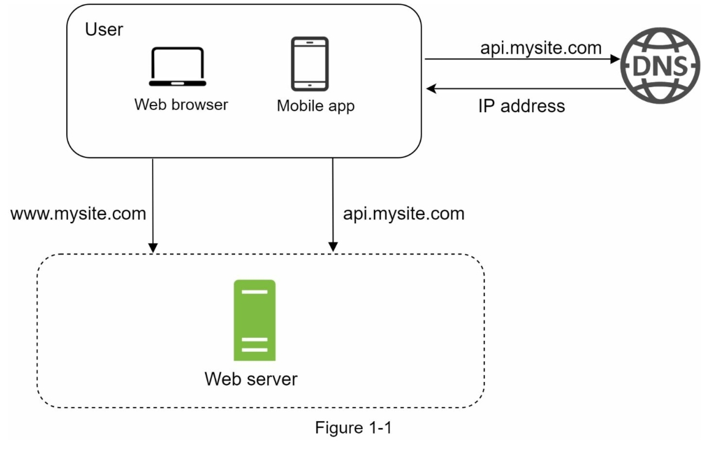

Request process diagram:

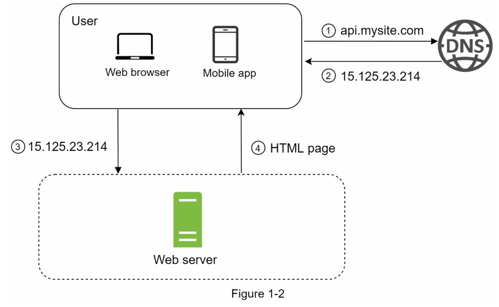

- **All components hosted on a same machine**: web server, application server, database, cache, etc.
- **Typical Request Process**:

  1.  DNS resolution to find the server's IP address.
  2.  Browser / APP directly sends HTTP request to the server though the IP address.
  3.  Server processes the request and responds with HTML, JSON, or other data formats. (JSON is commonly used for APIs.)

            ```
            GET /api/v1/users/123 HTTP/1.1
            {
              "id": 123,
              "name": "John Smith",
              "email": "john.smith@example.com",
              "phone": "123-456-7890",
            }
            ```

### Advantages and Disadvantages

- **Advantages**:

  - Simple to set up and manage
  - Low cost for small-scale applications
  - Easy to develop and test locally

- **Disadvantages**:
  - Limited scalability
  - Performance bottlenecks
  - Single point of failure, no redundancy

## Database

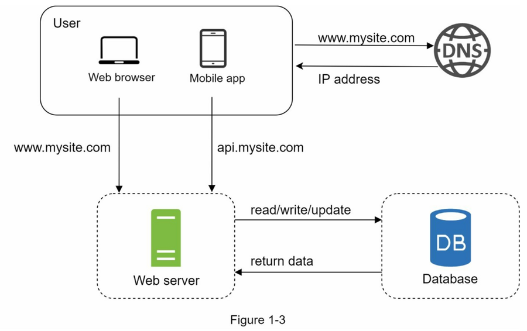

- Separate web server and database server allows to adjust resources independently.

### Compare Database Types

1. **Relational Database (RDBMS)**:

- Structured data with predefined schema
- Supports SQL queries
- ACID properties for data integrity
- Examples: PostgreSQL, MySQL, Oracle

2. **NoSQL Database**:

- Unstructured data
- Flexible schema, can handle large volumes of data
- Low latency for applications
- Examples: MongoDB, Cassandra, Neo4j

:::info
**ACID**

> ACID is the four core properties of database transactions.

- **Atomicity**: All operations in a transaction are completed successfully or none at all.
- **Consistency**: The database remains in a valid state before and after the transaction.
- **Isolation**: Transactions are isolated from each other, preventing interference.
- **Durability**: Once a transaction is committed, it remains in the database even in the event of a system failure.

:::

## Vertical scaling vs horizontal scaling

|                   | **Vertical Scaling** (Scale-Up)                 | **Horizontal Scaling** (Scale-Out)               |
| ----------------- | ----------------------------------------------- | ------------------------------------------------ |
| **Method**        | Add more CPU/RAM to a single server             | Add more nodes (servers) to the system           |
| **Advantages**    | Simple to implement, no need for data sharding  | No hardware limits, built-in redundancy          |
| **Disadvantages** | Physical limits, single point of failure (SPOF) | More complex deployment, requires load balancing |

## Load Balancer

Single entry point IP that distributes traffic evenly to multiple servers.

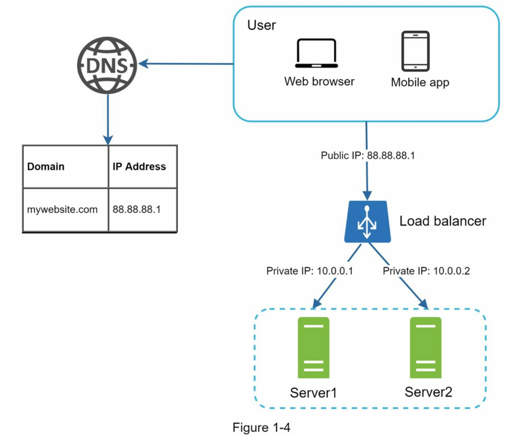

- Automatic failover
- Flexible add or remove servers on demand
- Internal servers communicate using private IPs, enhancing security

## Database Replication

- **Master**: Handles all write operations(Insert, Update, Delete), replicates data to slaves
- **Slave**: Read only; typically, there are more slaves than masters

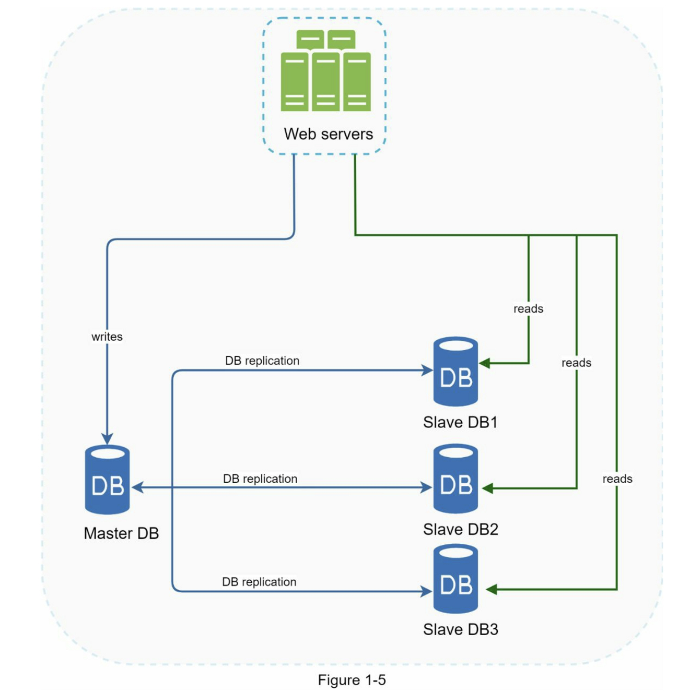

### Advantages and Disadvantages

- **Advantages**:
  - Read-write separation improves performance
  - Improved read performance
  - Data redundancy
  - Fault tolerance
- **Disadvantages**:
  - Replication lag
  - Write bottleneck
  - Application complexity
  - Increased cost

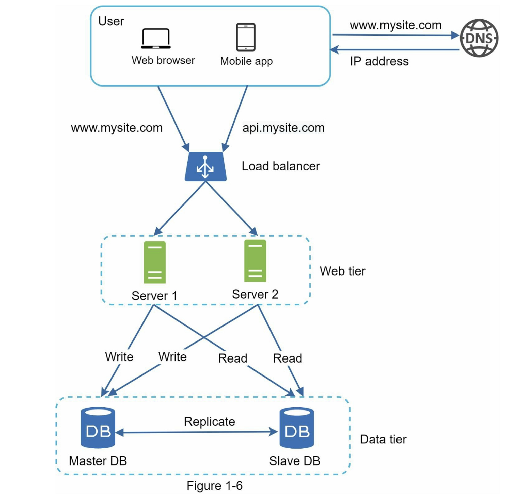

## Cache Layer

:::tip
This web server tier checks the cache first before querying the database.
:::

### Common Strategies

- **Cache-Aside(Lazy Loading)**: Application checks cache first, if hit, return data; if miss, query database and update cache.
  - **Pros**: Simple to implement, the cache only stores data that has been used or is frequently accessed.
  - **Cons**: The initial read may have higher latency and could return outdated data.
- **Read-Through**: Cache is updated automatically by cache system when data is read from the database.
  - **Pros**: Logic in application is simplified, cache is always up-to-date.
  - **Cons**: More complex to implement, requires cache system that supports this feature.
- **Refresh-Ahead**: When the cache is accessed, the backend will synchronously update the data to extend the TTL (Time To Live).
  - **Pros**: Avoid cache misses causing delays when TTL expires, ensures popular data is always available.
  - **Cons**: Complex implementation, may lead to unnecessary updates if data is not accessed frequently.

### Strategies Compare

| Strategy Name | Cache Hit Logic                        | Responsible Party               | Latency Risk Points                             | Complexity |
| ------------- | -------------------------------------- | ------------------------------- | ----------------------------------------------- | ---------- |
| Cache‑Aside   | Application loads data on miss         | Application                     | Consistency of initial reading and updated data | Low        |
| Read‑Through  | Cache layer auto-loads from DB on miss | Cache System                    | Slow on cache miss                              | Medium     |
| Refresh‑Ahead | Background refresh before TTL expiry   | Cache System/Background Process | Waste if prediction is poor                     | High       |

### Recommended Cache Strategies

> Focus on optimizing read performance

- For quickly implement and simple to maintain: **Cache-Aside**
- For automatically handle misses and updates: **Read-Through**
- For low latency and predictable data access patterns: **Refresh-Ahead**

### Cache considerations

- **When to use cache**: Cache data which is frequently accessed and updated infrequently.
- **Expiration Policy**: Set TTL to prevent outdated data.
- **Consistency**: Ensure cache is updated when data changes in the database.
- **Mitigating failures**: Use multiple cache servers or reserve memory to stabilize the system
- **Eviction Policy**:
  - **LRU (Least Recently Used)**(most popular): Evict the least recently accessed items first.
  - **LFU (Least Frequently Used)**: Evict the least frequently accessed items first.
  - **FIFO (First In First Out)**: Evict the oldest items first.

## Content Delivery Network (CDN)

:::info
CDN is a distributed network of servers that delivers web content to users based on their geographic location.

:::

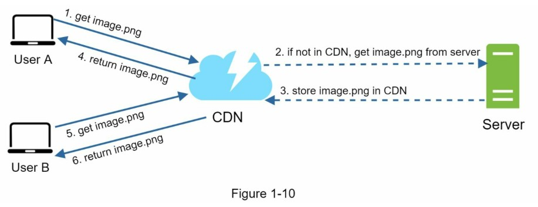

### Purpose

Reduce latency and improve performance by caching static content closer to users.

### How it works

1. User requests content (e.g., images, videos, scripts).
2. CDN routes the request to the nearest edge server.
3. If the content is cached, it is served directly from the edge server.
4. If not cached, the edge server fetches it from the origin server.

### Benefits

- Reduced latency
- Improved load times
- Offloads traffic from the origin server

### Considerations

- Cost: CDN services can be expensive, so low hit object should be excluded.
- TTL: How long content is cached before checking for updates.

## Stateful vs Stateless

### Stateful

Stateful server remembers the state of each user session from one request to the next.

- How it works:
  - The server stores session data in memory or a database.
  - Each request includes a session identifier (e.g., cookie) to retrieve the session state.

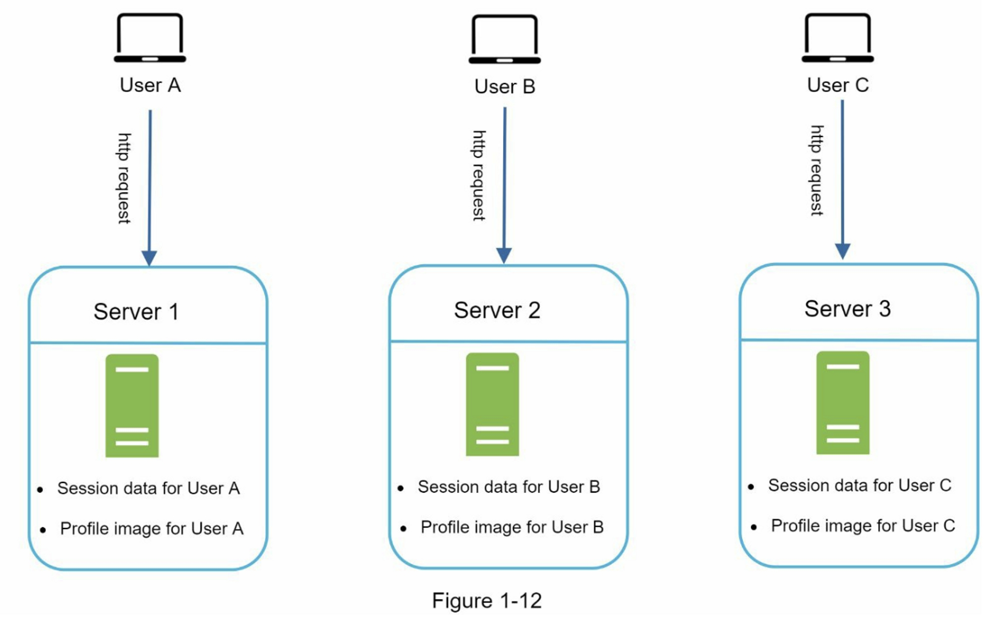

### Stateless

Stateless server does not remember and client state between requests.

- How it works:
  - The server does not store any session data, but provides the authentication token or user ID when the user logs in.
  - Each request contains all necessary information to process it (e.g., authentication token, user ID).

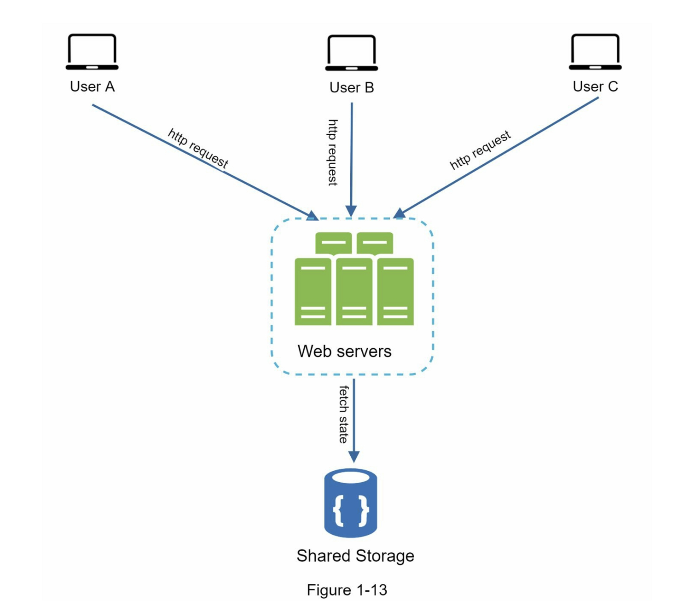

## Data Center (DC)

GeoDNS is used to route users to the nearest DC based on their geographic location.

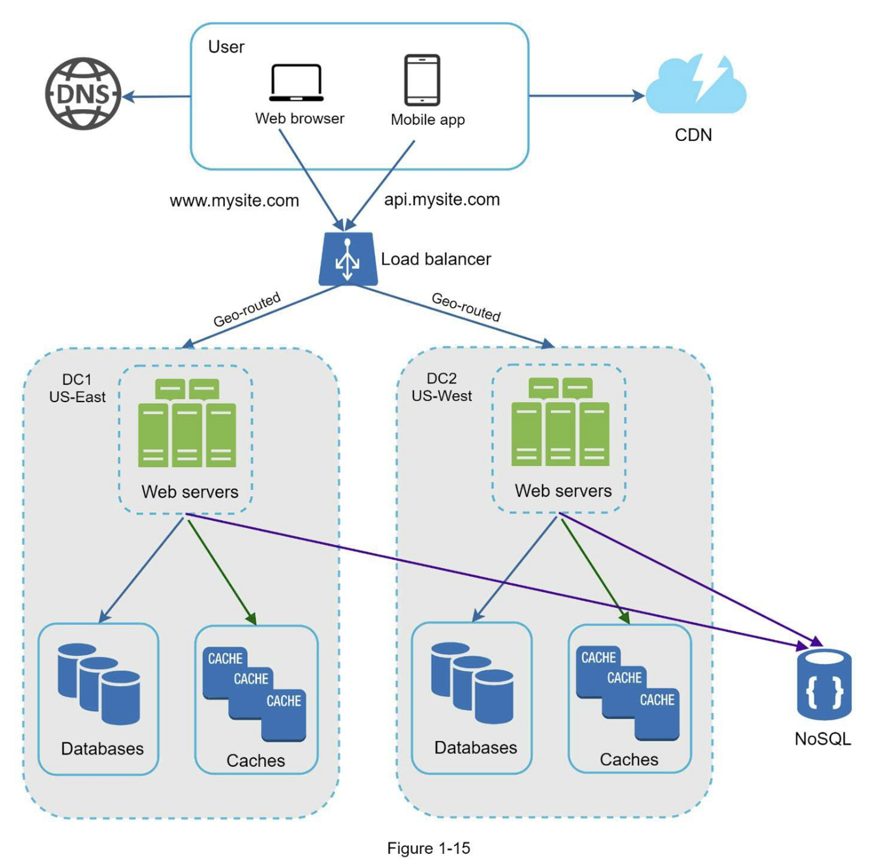

In case of a major outage, all traffic can be routed to a healthy DC.

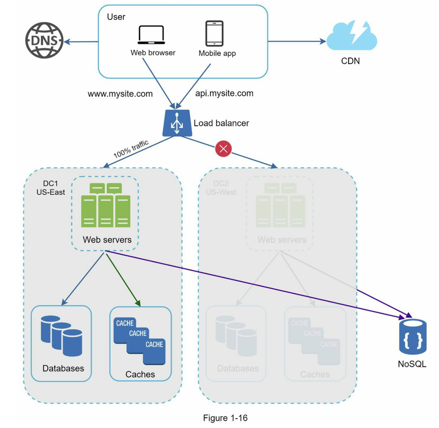

### Technical Challenges

- Traffic routing strategies
- Cross-region data synchronization
- Maintaining consistency between testing and deployment configurations

## Message Queue (MQ)

:::info
MQ is a message queue is a durable component, stored in memory, that supports asynchronous
communication

:::

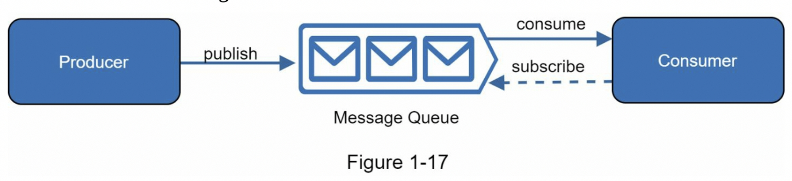

### Main Concepts

- **Producer**: Application that sends messages to the queue.
- **Consumer**: Application that receives messages from the queue.
- **Message**: Data sent from producer to consumer.

### Pros

- Decouples system components.
- Buffer sudden surge in requests.
- Allows individual components to scale independently.

### Common Use Cases

- Asynchronous processing (e.g., background, batch jobs)
- Tasks take a long time to complete
- Notification systems
- Email or SMS sending

## Logging, metrics, automation

### Logging

- **Purpose**: Monitor errors logs to identify issues in production.
- **Tools**: ELK Stack (Elasticsearch, Logstash, Kibana)

### Metrics

- **Purpose**: Monitor system performance and health.
- **Tools**: Grafana
- **Key Metrics**:
  - Host level (CPU, memory, disk I/O, etc.)
  - Aggregated level (Cache hit rate, DB QPS, etc.)
  - Request level (Latency, Error rate, etc.)
  - KPIs for business (Active users, Retention rate, etc.)

### Automation

- **Purpose**: CI/CD, scaling, and monitoring.
- **Tools**: Kubernetes, Terraform, GitHub Actions, Jenkins, etc.

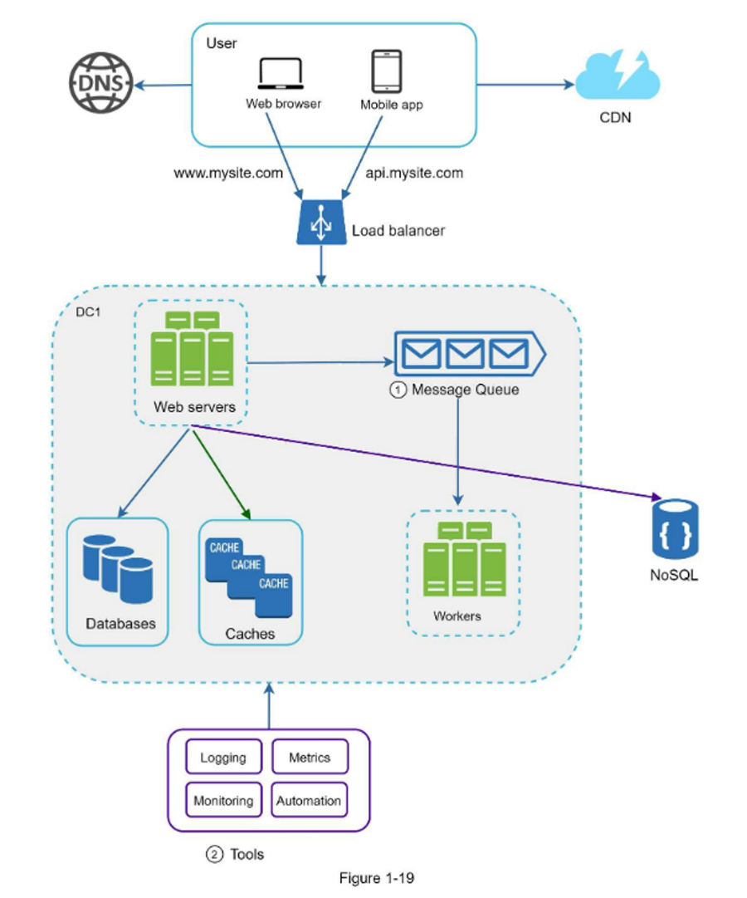

## Database Scaling

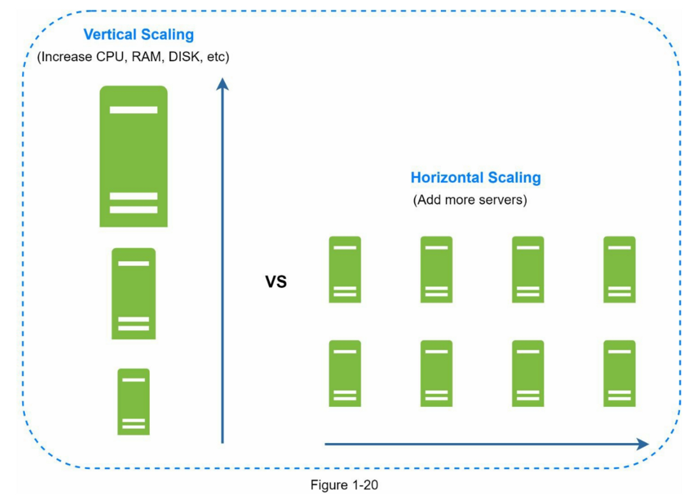

### Vertical Scaling

Scaling by adding more resources to a single database server. such as CPU, RAM, or Disk.

### Horizontal Scaling

Scaling by adding more database servers to distribute the load.

## Millions of Users and Beyond

1. Load Balancer + Stateless architecture
2. Cache layer to reduce database load
3. Support for multiple data centers
4. Message Queues to decouple heavy tasks
5. CDN for global static content delivery
6. Split tiers into separate servers (Server, Database, Cache, etc.)
7. Monitoring, logging, and automation for system health and performance

## Resources

<ul>
  <li>
    <span>Cache Strategies</span>
    <a href="https://medium.com/%40alxkm/caching-strategies-every-developer-should-learn-early-36c277b4a7d8" target="_blank">
      https://medium.com/%40alxkm/caching-strategies-every-developer-should-learn-early-36c277b4a7d8
    </a>
  </li>
</ul>
