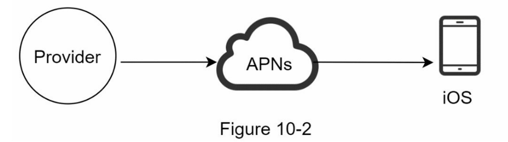
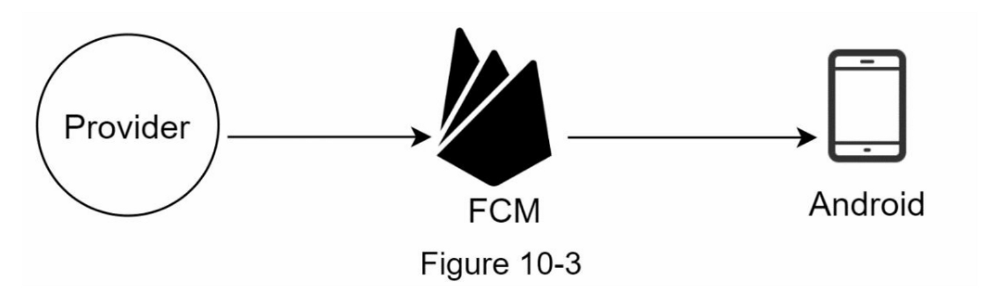
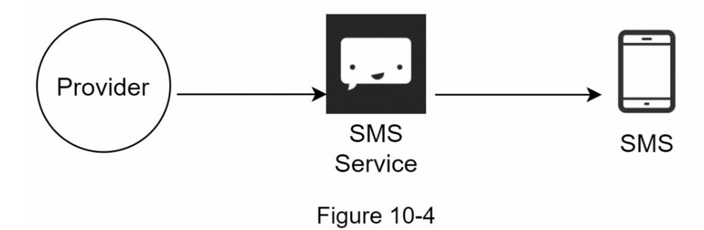
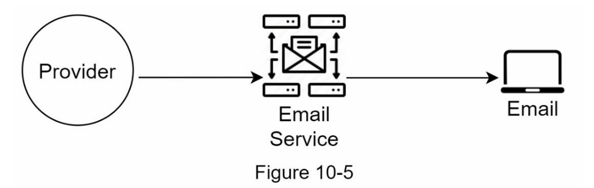
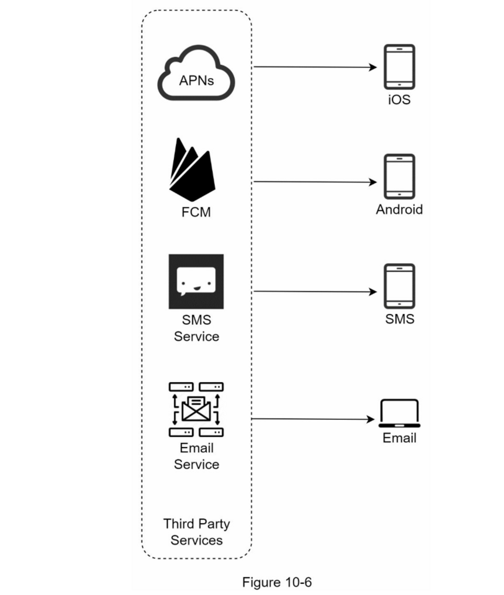
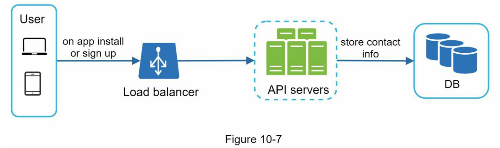
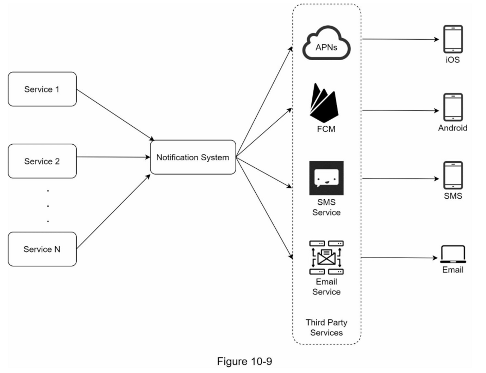
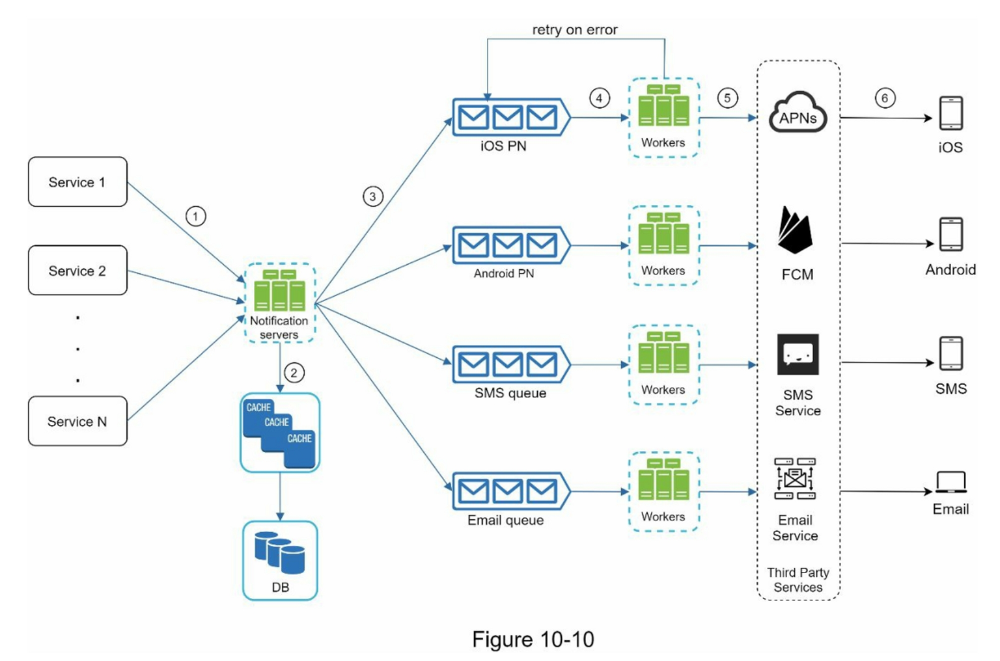
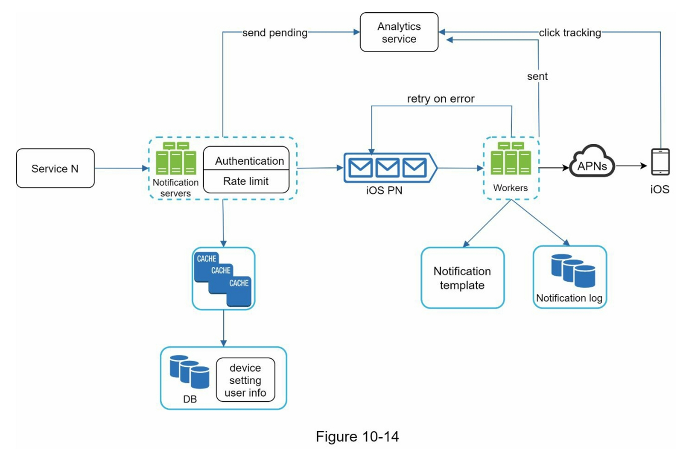

import InterviewQuestion from "@site/src/components/InterviewQuestion";

# Chapter 10: Design a Notification System

<details>
  <summary>What is a notification system?</summary>

A notification system is used to send notifications to users via different channels.

</details>

## Problem Understanding & Scope

1. Types of Notifications Supported
2. Real-time Requirement
3. Supported Devices
4. Notification Trigger Mechanisms
5. User Opt-out Capability
6. Scale and Volume

### Types of Notifications Supported

<details>
  <summary>What types of notifications are supported?</summary>

- Push Notifications
- SMS Notifications
- Email Notifications

</details>

### Real-time Requirement

The system is defined as a "soft real-time system". It means that the goal is to send notifications as soon as possible, but not necessarily within a specific time frame.

### Supported Devices

<details>
  <summary>What devices are supported?</summary>
  
- iOS
- Android
- Web

</details>

### Notification Trigger Mechanisms

<details>
  <summary>What notification trigger mechanisms are supported?</summary>

- client applications
- server-side scheduling

</details>

### User Opt-out Capability

User should be able to opt-out from notifications.

### Scale and Volume

Daily volume of notifications:

- 10 million mobile push notifications.
- 1 million SMS messages.
- 5 million emails.

## High-Level Architecture

### Different Types of Notifications

#### iOS Push Notification



:::note
To send iOS push notifications, there are three parties involved:

1. Provider
2. APNS (Apple Push Notification Service)
3. Device

:::

<details>
  <summary>What does the Provider do?</summary>
  
The Provider needs to build a notification payload and request APNS to send it to the Device.

Example payload:

```json
{
  "aps": {
    "alert": {
      "title": "Order Confirmation",
      "body": "Your order has been confirmed"
    },
    "badge": 1
  }
}
```

</details>

<details>
  <summary>What does the APNS do?</summary>
  
The APNS receives the notification payload from the Provider and sends it to the Device.

</details>

<details>
  <summary>What does the Device do?</summary>
  
The Device receives the notification from the APNS and displays it to the user.

</details>

#### Android Push Notification



:::note
To send Android push notifications, there are three parties involved:

1. Provider
2. Firebase Cloud Messaging (FCM)
3. Device

:::

#### SMS Notification



:::note
To send SMS notifications, there are three parties involved:

1. Provider
2. SMS Service
3. Device

:::

#### Email Notification



:::note
To send email notifications, there are three parties involved:

1. Provider
2. Email Service
3. Device

:::

### Integration with Third-Party Services



### How to send notifications to different devices?

1. Device Token Collection
2. Process of Sending/Receiving Notifications

#### Device Token Collection

To send notifications to different devices, we need to collect the device tokens from the devices and store them in the database.



#### Process of Sending/Receiving Notifications (Initial Design)



1. **Services 1 to N** (e.g., microservices, cron jobs, distributed systems) trigger notification events.
2. **Notification Service** receives the notification events and sends them to the third-party service.
3. **Third-Party Service** sends the notification to the User Device.
4. **User Device** (iOS, Android, SMS, Email) receives the notification.

#### Process of Sending/Receiving Notifications (Improved Design)

:::tip

- Move the database and cache out of the notification server.
- Add more notification servers and set up automatic horizontal scaling.
- Introduce message queues to decouple the system components.

:::



- **Services 1 to N** they are different services that send notification events though the API that the Notification Service provides.
- **Notification Service**

  - Provides API for Services 1 to N to send notification events.
  - Simple verification to ensure the notification event is valid.
  - Get the data from the database and cache what the notification needs.
  - Send the notification to the third-party service.

- **Cache** (e.g., User information, Device information, Notification template, etc.)
- **Database** (e.g., Uesr, Notification, Config, etc.)
- **Message Queue**: Decouple the system components. As buffer to handle the sudden surge in requests.
- **Worker(Consumer)**: Consume the message from the message queue and send the notification to the third-party service.
- **Third-Party Service**
- **User Device**

## Design Deep Dive

### Availability & Reliability

<details>
  <summary>How to prevent data loss?</summary>

Most important is to ensure the data cannot be lost.

- Data must be persisted.
- Implement retry mechanism.

</details>

### Additional Considerations

- Notification Template
- Notification Configuration
- Rate Limiting
- Retry Mechanism
- Security
- Monitoring
- Event Tracking

### Updated Design


