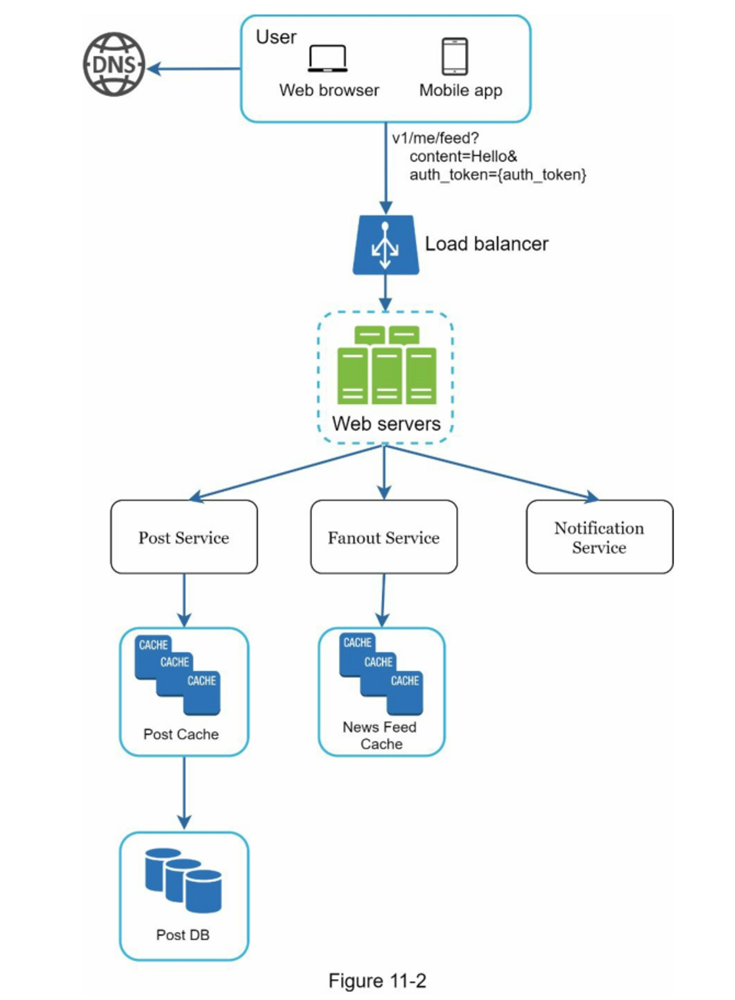
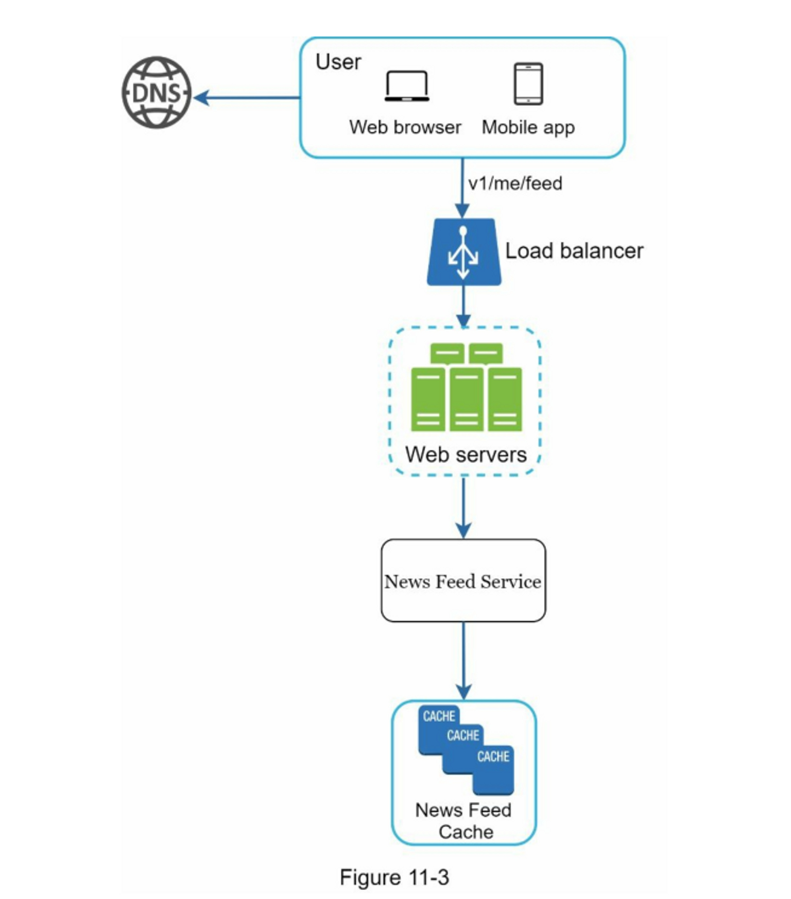
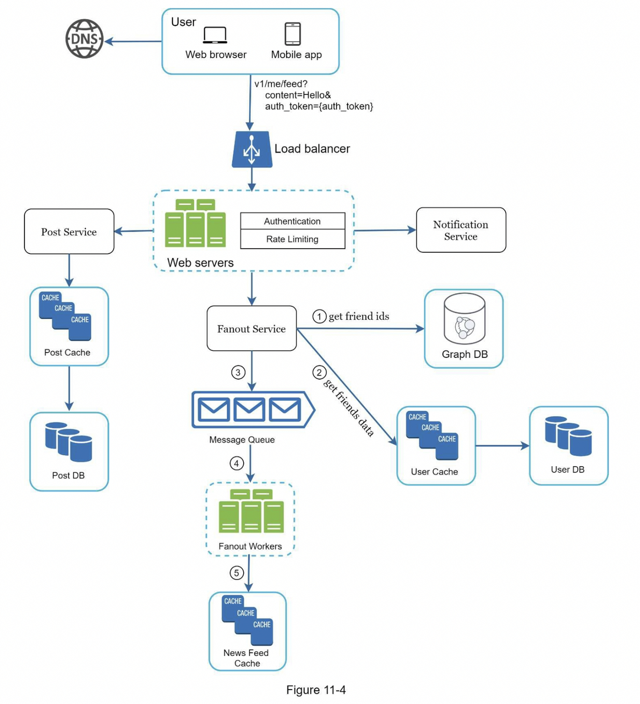

import InterviewQuestion from "@site/src/components/InterviewQuestion";

# Chapter 11: Design a News Feed System

In this chapter, we are asked to design a **News Feed System**.

> According to Facebook: “News Feed is a constantly updating list of stories in the middle of your home page. News Feed includes status updates, photos, videos, links, app activity, and likes from people, Pages, and groups that you follow.”

This is a popular system design interview question. Variants include designing Facebook News Feed, Instagram Feed, or Twitter Timeline.

---

## Step 1: Understand the Problem and Scope

- **Platforms**: Web + Mobile (iOS/Android)
- **Core Features**:
  - Users can post content
  - Users can see posts from friends in their feed
- **Sorting**: Reverse chronological order (simplified)
- **User Graph**: Each user can have up to 5000 friends
- **Scale**: 10 million Daily Active Users (DAU)
- **Post Types**: Text, images, video supported

---

## Step 2: High-Level Design

### Two Main Flows:

1. **Feed Publishing**



2. **News Feed Building**



---

### API Design

#### Post Publishing API
```http
POST /v1/me/feed
Params:
- content: post body
- auth_token: for authentication
```

#### Feed Retrieval API
```http
GET /v1/me/feed
Params:
- auth_token: for authentication
```

---

## Step 3: Deep Dive Design



### (A) Feed Publishing

#### Core Components:

- **Web Server**: Handles authentication and rate limiting  
- **Post Service**: Stores post to DB and cache  
- **Fanout Service**: Distributes post to followers' feeds  
- **Notification Service**: Notifies friends of the new post  

#### Fanout Models Comparison

| Model              | Pros                                 | Cons                                          |
|-------------------|--------------------------------------|-----------------------------------------------|
| Push Fanout       | Precomputed cache, fast reads        | Poor performance for celebrities, hot keys    |
| Pull Fanout       | Good for inactive users, saves CPU   | Slower read latency                           |
| Hybrid            | Push for normal users, Pull for celebs | Complex logic to split user types           |


---

### (B) Feed Retrieval

1. User sends `GET /v1/me/feed`  
2. Load balancer routes to web server  
3. Web server calls Newsfeed Service  
4. Service fetches `post_id` list from feed cache  
5. Uses Content/User Cache/CDN to fetch full post data  
6. Returns final feed JSON to client  


---

### Cache Architecture (5 Layers)

1. **News Feed Cache**: Stores list of post IDs per user  
2. **Content Cache**: Hot post content  
3. **Social Graph Cache**: User relationship graph  
4. **Action Cache**: User interactions (likes, replies, etc.)  
5. **Counter Cache**: Like count, comment count, followers, etc.  


---

## Step 4: Summary & Design Considerations

- DB Scaling: Vertical vs Horizontal  
- SQL vs NoSQL  
- Master-Slave Replication  
- Read/Write Separation  
- Sharding  
- Stateless Web Layer  
- Caching Wherever Possible  
- Multi-Region Data Centers  
- Message Queues for Decoupling  
- Monitoring Metrics:  
  - QPS  
  - Feed refresh latency  
  - Cache hit rate  

---

## Summary Notes (Quick Reference)

### Problem Scope

- Platform: Web + Mobile  
- Features: Posting + Viewing Feed  
- Sorting: Reverse chronological  
- Scale: 10M DAU, 5K friends max  
- Content: Text, image, video  

### High-Level Architecture

- Publishing: Write to DB + cache → Fanout → update friends’ feeds  
- Retrieval: Get post_ids from cache → hydrate content → return JSON  

### Fanout

- Push: Fast read, slow write for celebs  
- Pull: Slower read, cheap write  
- Hybrid: Normal users push, celebrities pull  

### Cache Layers

- Feed Cache  
- Content Cache  
- Social Graph Cache  
- Action Cache  
- Counter Cache  

### Key Considerations

- SQL vs NoSQL  
- Replication and sharding  
- Stateless services  
- Multi-tier caching  
- Decoupling via queues  
- Metrics (QPS / Latency / Hit Rate)  

---

## References

[1] [How News Feed Works](https://www.facebook.com/help/327131014036297/)  
[2] [Friend Recommendations with Neo4j](http://geekswithblogs.net/brendonpage/archive/2015/10/26/friend-of-friend-recommendations-with-neo4j.aspx)

---


