import InterviewQuestion from "@site/src/components/InterviewQuestion";

# Chapter 15: DESIGN GOOGLE DRIVE

## Understand Google Drive
- Google Drive is a file storage and synchronization service that helps you store documents, photos, videos, and other files in the cloud.
  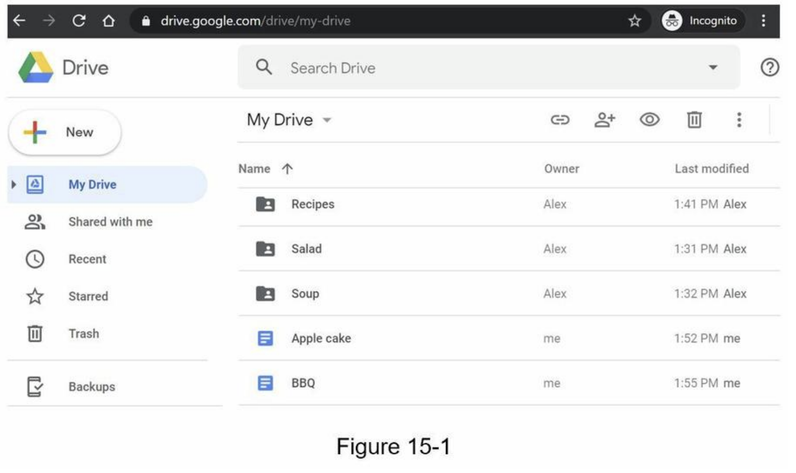
  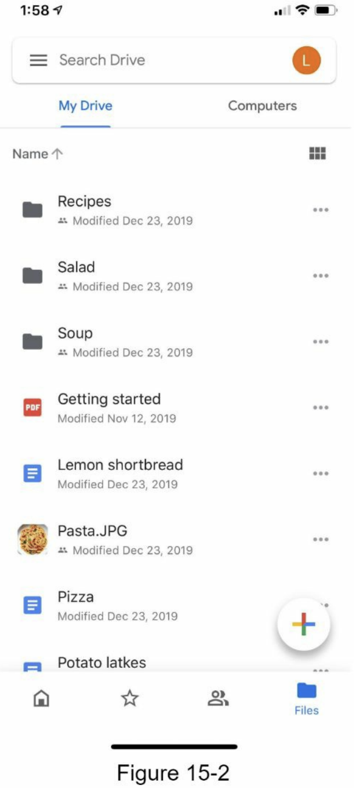

## Step 1 - Understand the problem and establish design scope
  - requirements
    - features: Upload and download files, file sync, and notifications
    - mobile and web app
    - supported file formats: any file type
    - files are encrypted
    - size limit: `10 GB` or smaller
    - 10M DAU (Daily Active Users)
  - Focused features:
    - Add files -> drag and drop
    - Download files
    - Sync files across multiple devices
    - See file revisions
    - Share files
    - Send a notification(edited, deleted, or shared)
  - Not included
    - Google doc editing and collaboration

## Back of the envelope estimation
  - assume ->  `50` million signed up users and `10` million DA
  - Users get `10` GB free space
  - Assume users upload `2` files per day. The average file size is `500 KB`
  - `1:1` read to write ratio
  - Total space allocated: `50 million * 10 GB = 500 Petabyte`
  - QPS (Queries Per Second) for upload API: `10 million * 2 uploads / 24 hours / 3600 seconds = ~ 240`
  - Peak QPS = QPS * 2 = `480`

## Step 2 - Propose high-level design and get buy-in
  - a single server -> scale it up to support millions of users
  - a single server setup
    - web server (Apache web server) -> upload and download files
    - A database (MySql database) -> metadata (user data, login info, files info)
    - A storage system to store files -> 1TB
    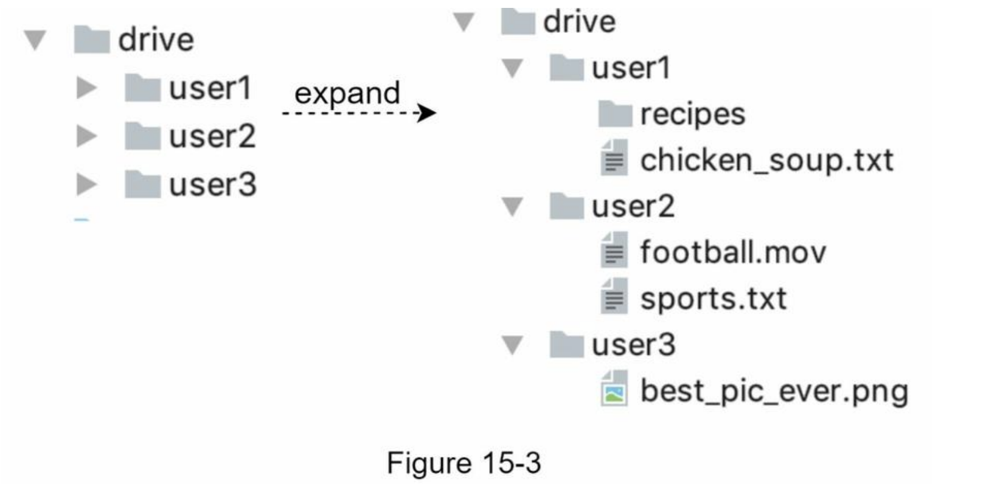

## APIs
  - 3 APis: upload a file, download a file, and get
file revisions
  - user authentication and use HTTPS
  - **1. Upload a file to Google Drive**
    - Two types of uploads are supported:
      - Simple upload -> file size is small
      - Resumable upload -> file size is large and there is high chance of network interruption
    - example: `https://api.example.com/files/upload?uploadType=resumable`
    - params:
      - uploadType=resumable
      - data: Local file to be uploaded
    - 3 steps of resumable uploading
      -  Send the initial request to retrieve the resumable URL.
      - Upload the data and monitor upload state.
      - If upload is disturbed, resume the upload.
  - **2. Download a file from Google Drive**
    - example: `https://api.example.com/files/download`
    - params:
      - path: download file path.
      - example:
        <pre>
        ```
        {
          "path": "/recipes/soup/best_soup.txt"
        }
        ```
        </pre>
  - **3. Get file revisions**
    - example: ` https://api.example.com/files/list_revisions`
    - params:
      - path: The path to the file you want to get the revision history.
      - limit: The maximum number of revisions to return.
      - example:
        <pre>
        ```
        {
          "path": "/recipes/soup/best_soup.txt",
          "limit": 20
        }
        ```
        </pre>

## Move away from single server
  - Not enough space
    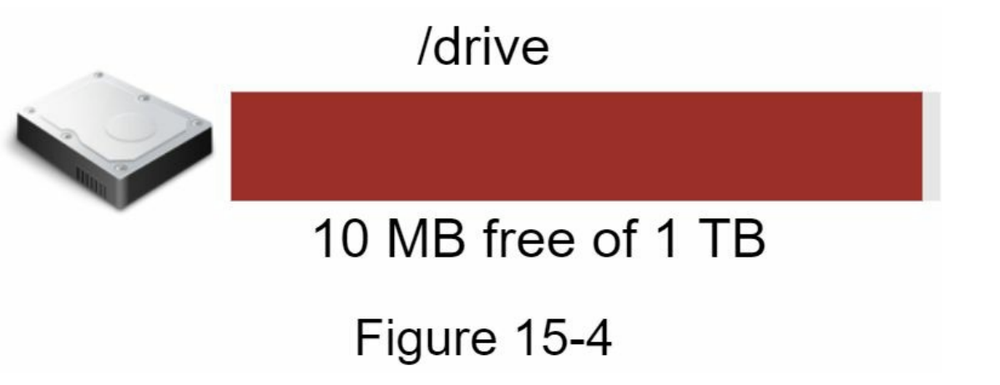
  - sharding based on user_id -> potential data losses in case of storage server outage
    
  - Amazon S3 supports same-region and cross-region replication
    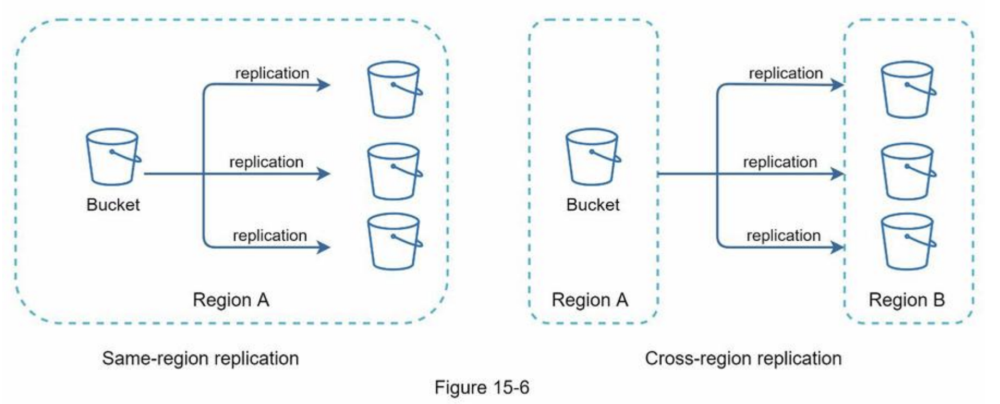
  - decoupled web servers, metadata database, and file storage from a single server
  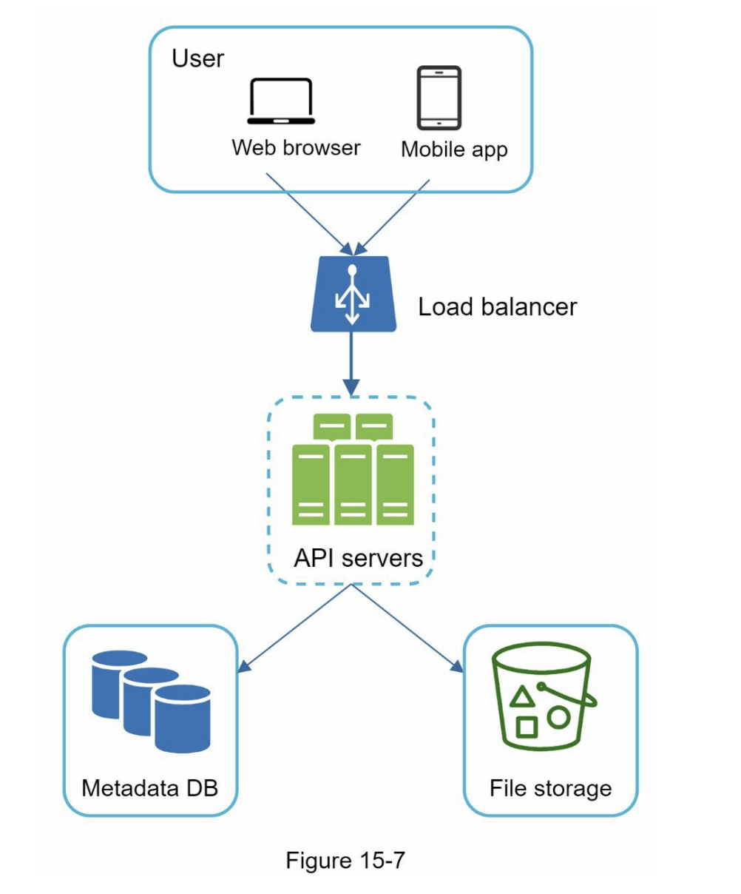

## Sync conflicts
  - **our strategy: the first version that gets processed wins, and the version that gets processed later receives a conflict**
  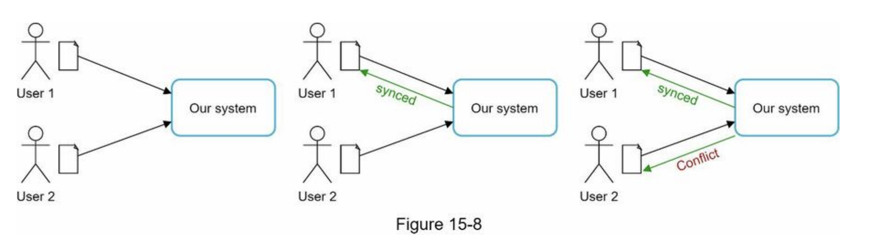
  - User 2 has the option to merge both files or override one version with the other.
  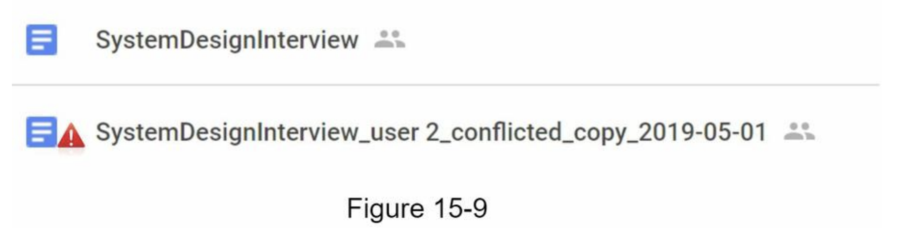

## High-level design
  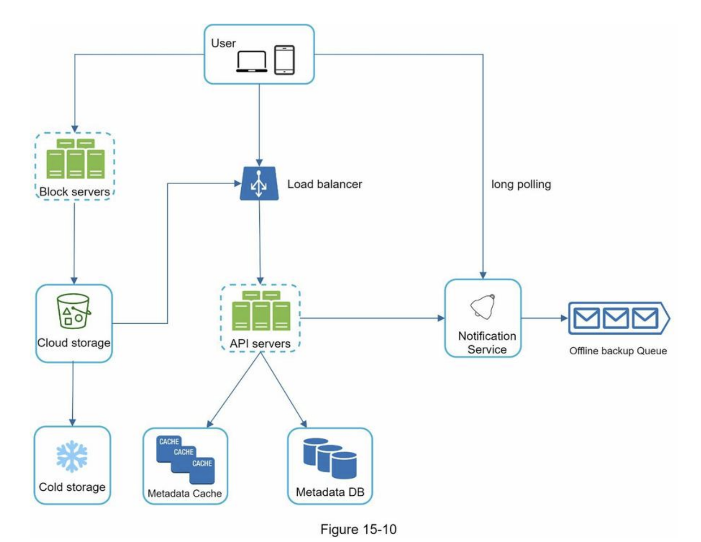
  - **Block servers**
    - upload blocks to cloud storage
    - block-level storage
    - A file can be split into several blocks -> each with a unique hash value -> stored in our metadata database
    - independent object -> stored in S3
    - reconstruct a file -> are joined in a particular order
    - the block size (e.g. Dropbox): maximal size of a block to `4MB`
  - **Cloud storage**
    - A file is split into smaller blocks and stored in cloud storage.
  - **Cold storage**
    -  storing inactive data (files are not accessed for a long time)
  - **Load balancer**
    -  evenly distributes requests
  - **API servers**
    - other than the uploading flow
    - user authentication, managing user profile, updating file metadata, etc.
  - **Metadata database**
    - metadata of users, files, blocks, versions, etc
  - **Metadata cache**
    - Some of the metadata are cached for fast retrieval.
  - **Notification service**
    - publisher/subscriber system
    - notifies relevant clients when a file is added/edited/removed elsewhere so they can pull the latest changes
  - **Offline backup queue**
    - a client is offline -> the offline backup queue stores the info -> changes will be synced when the client is online

  ## Step 3 - Design deep dive
    - **Block servers**
      - large files -> minimize the amount of network traffic being transmitted
        - **Delta sync**. When a file is modified, only modified blocks are synced instead of the whole file using a sync algorithm
        - **Compression** -> using compression algorithms depending on file types
          - e.g. gzip and bzip2 are used to compress text files
      - block server
      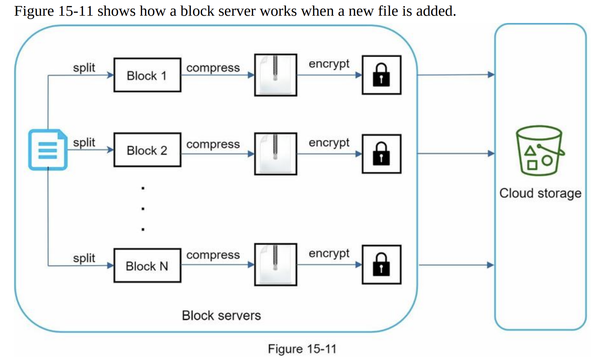
      - Instead of uploading the whole file to the storage system, only modified blocks are transferred -> save network traffic by providing delta sync and compression
      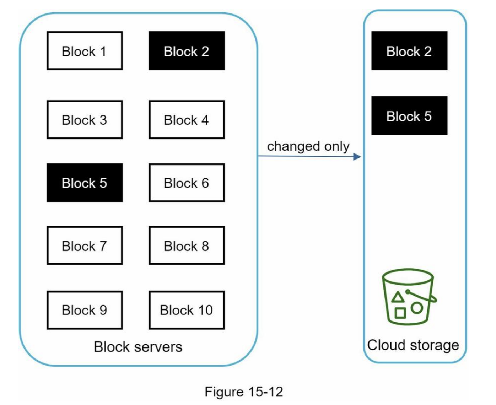
    - **High consistency requirement**
      - Memory caches adopt an eventual consistency model by default -> different replicas might have different data.
      - To achieve strong consistency, ensure:
        - Data in cache replicas and the master is consistent
        - Invalidate caches on database write to ensure cache and database hold the same value.
      - a relational database ->  strong consistency -> because ACID (Atomicity, Consistency, Isolation, Durability) => we choose it in our design
      - NoSQL databases -> not support ACID -> must be programmatically incorporated in synchronization logic
    - **Metadata database**
      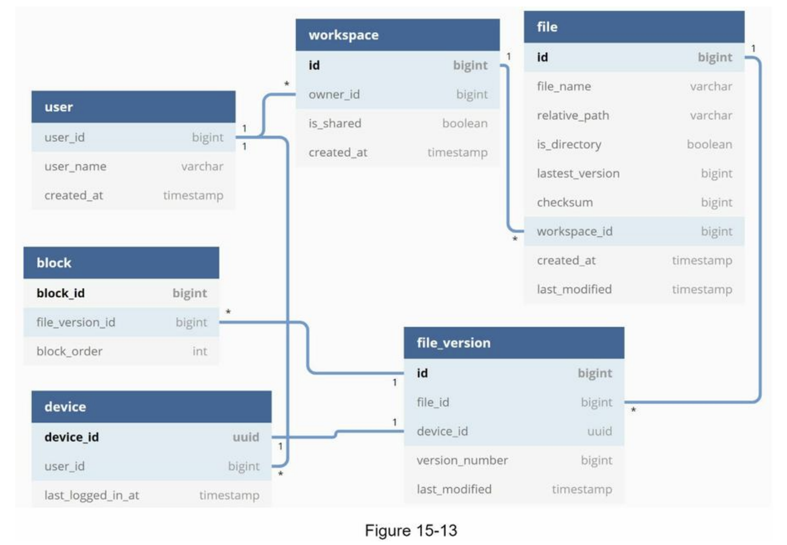
    - **Upload flow**
      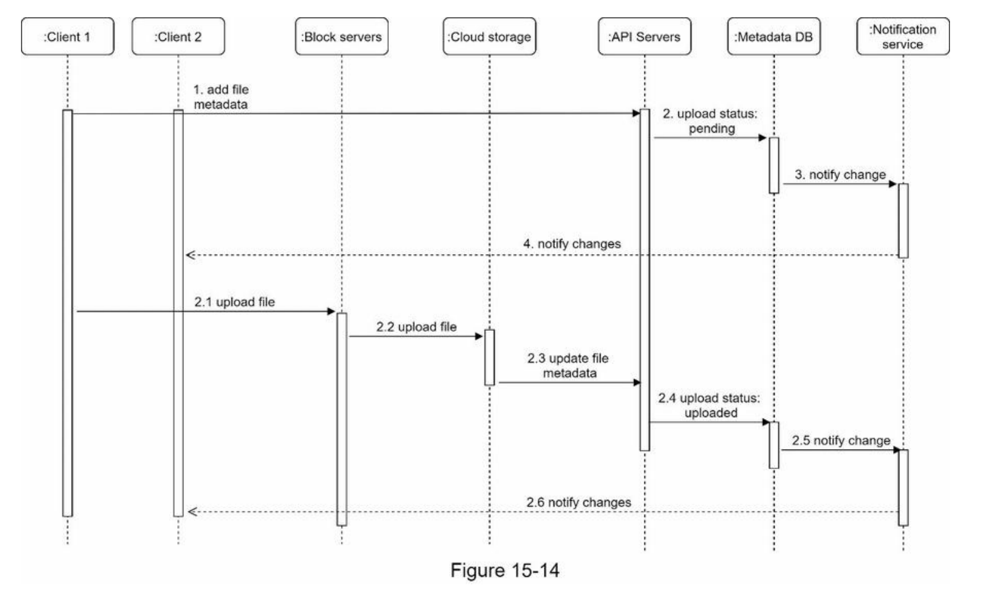
    - **Download flow**
      - Download flow is triggered when a file is added or edited elsewhere.
       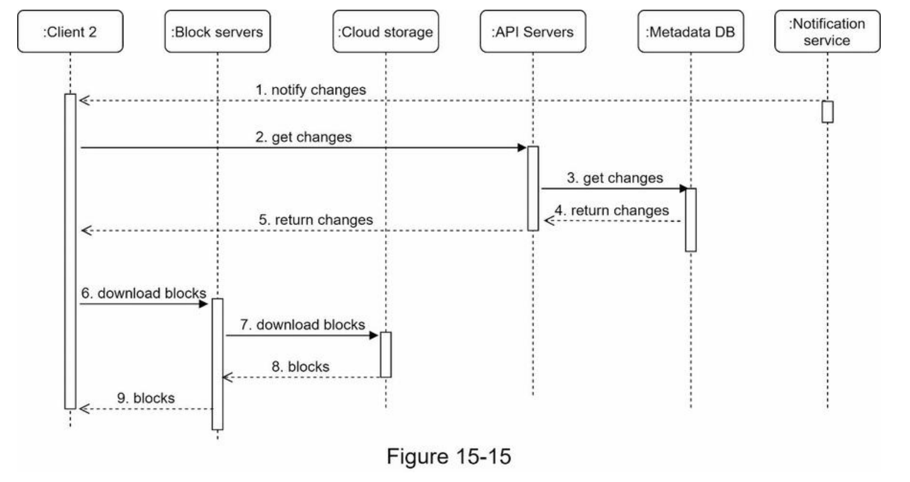
    - **Notification service**
      - notification service allows data to be transferred to clients as events happen.
        - **Long polling**. Dropbox uses long polling
        - **WebSocket** -> a persistent connection between the client and the server -> bi-directional
      - we opt for long polling for the following two reasons:
        - Communication for notification service is not bi-directional
        -  WebSocket is suited for real-time bi-directional communication such as a chat app
      - **long polling**
        - each client establishes a long poll connection to the notification service
        - If changes to a file are detected -> he client will close the long poll connection
        - a client must connect to the metadata server to download the latest changes
        - a response is received or connection timeout is reached ->  a new request to keep the connection open
    - **Save storage space**