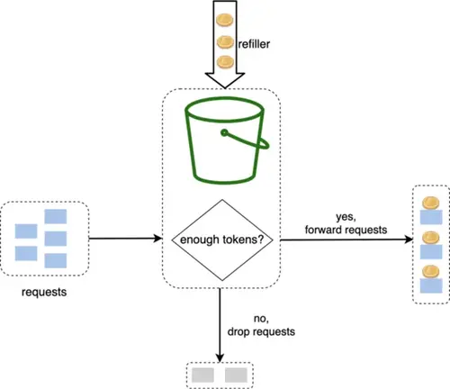

import InterviewQuestion from '@site/src/components/InterviewQuestion';

# Chapter 4: Design a Rate Limiter

:::note
A **rate limiter** is a crucial component in any distributed system. Its primary function is to control the traffic rate for requests sent to a service. In simple terms, it sets a cap on how many times a user, device, or IP address can perform an action within a specific time frame.

**Why Do We Need It?**

1.  **Prevent DoS Attacks & Resource Starvation**: A rate limiter is the first line of defense against both intentional and unintentional Denial of Service (DoS) attacks. By blocking excessive requests, it ensures the service remains available for legitimate users. For example, Twitter limits tweets to 300 per 3 hours.
2.  **Reduce Costs**: Limiting requests directly translates to lower operational costs. This is critical for services that rely on paid third-party APIs (e.g., for payment processing or credit checks) and for managing cloud resource consumption.
3.  **Prevent Server Overload**: It acts as a filter to prevent backend servers from being overwhelmed by traffic spikes, whether from misbehaving bots or legitimate but high-volume users. This ensures system stability.

:::

## Understand the Problem & Establish Design Scope

This phase is about asking clarifying questions to transform a vague request like "Design a Rate Limiter" into a concrete set of requirements. The dialogue between the candidate and interviewer is key.

### Requirements Summary

Based on the initial discussion, the core requirements for our system are:

* **Accuracy**: It must effectively limit requests according to defined rules.
* **Low Latency**: It should not add significant overhead to the HTTP response time.
* **Memory Efficiency**: It must operate with a small memory footprint.
* **Distributed**: The solution must work across multiple servers.
* **Clear Exception Handling**: Throttled users must be clearly informed (e.g., via HTTP status code `429`).
* **High Fault Tolerance**: If the rate limiter fails, it should not bring down the entire system (fail-open vs. fail-closed).

## High-Level Design - Placement and Architecture

Once the requirements are clear, the next step is to outline the high-level architecture. A fundamental first decision is where the rate limiter logic should live.

### Where to Put the Rate Limiter?

There are three primary locations to implement a rate limiter, each with significant trade-offs.

1.  **Client-Side**: Implementation is done directly in the frontend application.
    -   **Pro**: Can provide immediate feedback to the user.
    -   **Con**: **Completely unreliable for security.** A malicious actor can easily bypass client-side logic and directly attack your servers. It should never be the only line of defense.

2.  **Server-Side (In the Application)**: The logic is embedded directly within the API server's code.
    -   **Pro**: It's reliable and secure as it's under your control.
    -   **Con**: It couples the rate-limiting logic with the business logic. If you have multiple services, you might duplicate this logic across all of them, leading to maintenance issues.

3.  **Middleware (API Gateway)**: The logic is placed in a separate layer that sits in front of your API servers. This is the most common and recommended approach in modern architectures.


    -   **Pro**:
        -   **Decoupling**: Keeps rate-limiting concerns separate from your application services.
        -   **Centralized Control**: Manage rules for all your services in one place.
        -   **Efficiency**: Services like API Gateways are often highly optimized for this kind of traffic management.
    -   **Con**: Introduces another component to manage (though often this is a managed cloud service).

### How to Choose? General Guidelines

The "right" choice depends on your specific context. Consider these factors:

-   **Existing Tech Stack**: Are you already using a microservices architecture with an API Gateway? If so, adding rate limiting there is a natural fit.
-   **Control vs. Convenience**: Implementing it yourself gives you full control over the algorithm. Using a third-party gateway might limit your choices but is much faster to deploy.
-   **Engineering Resources**: Building a robust, distributed rate-limiting service from scratch is a significant undertaking. If resources are limited, a commercial or managed solution is often the better business decision.

## Deep Dive into Rate-Limiting Algorithms

Choosing the right algorithm is crucial as it directly impacts the accuracy, performance, and memory usage of the rate limiter. Here's a breakdown of the most common algorithms and their trade-offs.

### 1. Token Bucket Algorithm

This is one of the most widely used and versatile algorithms.



-   **How it Works**:
    1.  A bucket with a fixed capacity is created.
    2.  Tokens are added to the bucket at a constant `refill rate`.
    3.  If the bucket is full, new tokens are discarded.
    4.  Each incoming request must consume one token from the bucket to pass.
    5.  If the bucket is empty, the request is rejected.
-   **Key Idea**: It allows for **bursts of traffic**. As long as there are tokens in the bucket, a quick succession of requests can pass. The `bucket size` defines the maximum burst size.
-   **Parameters**: `bucket_size`, `refill_rate`.
-   **Pros**:
    -   Easy to implement.
    -   Memory efficient.
    -   Flexible; allows for short-term bursts, which is good for user experience.
-   **Cons**:
    -   Tuning the two parameters (`bucket_size` and `refill_rate`) can be challenging to get just right for the specific use case.

### 2. Leaky Bucket Algorithm

This algorithm focuses on smoothing out the request rate.


-   **How it Works**:
    1.  Requests are added to a First-In-First-Out (FIFO) queue upon arrival.
    2.  The system processes requests from the queue at a fixed, constant rate.
    3.  If the queue is full, new incoming requests are discarded.
-   **Key Idea**: It enforces a **stable outflow rate**, regardless of how bursty the inflow is. It smooths out traffic spikes.
-   **Parameters**: `bucket_size` (queue size), `outflow_rate`.
-   **Pros**:
    -   Memory efficient due to fixed queue size.
    -   Guarantees a stable, predictable load on the downstream services.
-   **Cons**:
    -   Inflexible. A burst of traffic can fill the queue, causing recent requests to be dropped even if the average rate is low. It doesn't handle legitimate bursts well.

### 3. Fixed Window Counter Algorithm

A simple but less accurate approach.


-   **How it Works**:
    1.  The timeline is divided into fixed windows (e.g., 1-minute intervals).
    2.  Each window has a counter.
    3.  Each request increments the counter for the current window.
    4.  If the counter exceeds the limit, requests are dropped until the next window begins.
-   **Key Flaw**: **Edge/Boundary Problem**. A burst of traffic at the boundary of two windows can allow up to 2x the limit to pass through in a real-time window. (e.g., if the limit is 100/min, a user could send 100 requests at 1:00:59 and another 100 at 1:01:01).
-   **Pros**:
    -   Easy to understand and implement.
    -   Memory efficient (only needs one counter per key).
-   **Cons**:
    -   The boundary problem can lead to inaccurate rate limiting.

### 4. Sliding Window Log Algorithm

This algorithm fixes the flaws of the Fixed Window approach with high precision.


-   **How it Works**:
    1.  It tracks the timestamp of every single request in a log (e.g., a Redis sorted set).
    2.  When a new request arrives, it removes all timestamps from the log that are older than the current window size.
    3.  It then counts the number of remaining timestamps in the log. If the count is below the limit, the request is accepted and its timestamp is added to the log.
-   **Pros**:
    -   **Very accurate**. It perfectly enforces the rate limit over any sliding time window.
-   **Cons**:
    -   **High memory consumption**. Storing a timestamp for every request can be very memory-intensive, especially for high-traffic services.

### 5. Sliding Window Counter Algorithm

A hybrid approach that offers a good balance between accuracy and efficiency.


-   **How it Works**: It approximates the count in the sliding window. A common method is:
    1.  Track counters for the current and previous time windows.
    2.  When a new request arrives, estimate the number of requests in the rolling window by taking a weighted sum of the two counters.
    3.  Formula: `count_in_current_window + (count_in_previous_window * overlap_percentage)`
-   **Pros**:
    -   Smoothes out traffic spikes and largely solves the boundary problem.
    -   Much more memory-efficient than the Sliding Window Log.
-   **Cons**:
    -   **Not 100% accurate**. It's an approximation, but as Cloudflare noted, the error rate is often extremely low and acceptable for most use cases.

## System Architecture & Rule Management

After choosing an algorithm, we need to design the overall system that puts it into practice. This involves deciding where to store counters, how to manage rules, and how the system components interact.

### High-Level Architecture

The core idea is to have a centralized, high-speed data store to maintain the counters for our rate-limiting logic.

-   **Why not a traditional database?** Using a SQL/NoSQL database on disk would be far too slow. The latency of disk access would make the rate limiter itself a major performance bottleneck.
-   **The right tool: In-Memory Cache**. An in-memory store like **Redis** is the ideal choice.
    -   **Speed**: It's incredibly fast because all data lives in RAM.
    -   **Helpful Commands**: Redis provides atomic commands that are perfect for rate limiting:
        -   `INCR`: Atomically increments a counter by one.
        -   `EXPIRE`: Sets a time-to-live (TTL) on a key, after which it's automatically deleted. This is perfect for window-based algorithms.

The basic request flow looks like this:
`Client` -> `Rate Limiter Middleware` -> `Redis (Check & INCR)` -> `API Server`


### Managing Rate-Limiting Rules

The system must be flexible enough to support various rules.

-   **Rule Definition**: Rules are typically defined in a human-readable format like YAML or JSON and stored in configuration files. This separates the logic from the code.
-   **Example (from Lyft)**:
    ```yaml
    domain: messaging
    descriptors:
      - key: message_type
        value: marketing
        rate_limit:
          unit: day
          requests_per_unit: 5
    ```
-   **Loading Rules**: These configuration files are stored on disk. The rate limiter workers periodically pull these rules and load them into a local cache for fast access. This allows for dynamic rule changes without needing to restart the service.

### Handling Throttled Requests: The Client Experience

When a request is blocked, it's crucial to provide clear feedback to the client.

-   **HTTP Status Code**: The standard response is `429 Too Many Requests`.
-   **Informative Headers**: To help the client behave correctly, the rate limiter should return informative HTTP headers:
    -   `X-Ratelimit-Limit`: The total number of requests the client can make in a time window.
    -   `X-Ratelimit-Remaining`: The number of requests remaining in the current window.
    -   `X-Ratelimit-Retry-After`: The number of seconds the client should wait before making another request.

This turns the rate limiter from a black box into a predictable system that developers can easily work with.

## Distributed Systems Challenges & Optimizations

Building a rate limiter for a single server is straightforward. The real complexity emerges when scaling it to a distributed environment. This section covers the key challenges and advanced optimizations.

### Challenge 1: Race Conditions

In a highly concurrent environment, multiple requests can try to update the same counter simultaneously, leading to incorrect counts.


-   **The Problem**:
    1.  Request A reads `counter` value (e.g., `3`) from Redis.
    2.  Request B reads the same `counter` value (`3`) before A has updated it.
    3.  Request A calculates `3 + 1 = 4` and writes `4` back to Redis.
    4.  Request B also calculates `3 + 1 = 4` and writes `4` back to Redis.
    5.  **Result**: The counter should be `5`, but it's incorrectly set to `4`. Two requests were processed, but the counter only incremented once.
-   **The Solution**: The operation must be **atomic**.
    -   *Bad Solution*: Using traditional locks would solve the problem but would drastically slow down the system, making it a bottleneck.
    -   *Good Solution*: Use the features of your data store. For Redis, this means using a **Lua script**. The script can perform multiple commands (e.g., read, compare, and increment) on the Redis server as a single, uninterruptible atomic operation, which completely eliminates race conditions without the overhead of client-side locking.

### Challenge 2: Synchronization

When you have multiple rate limiter servers (which you will in any large-scale system), you need to ensure they share the same counter data.


-   **The Problem**: A client's requests can be routed to different servers. If Client A sends a request to Server 1, Server 1 updates its local count. If the next request from Client A goes to Server 2, Server 2 has no knowledge of the first request and the rate limit won't be enforced correctly.
-   **The Solution**: Use a **centralized data store** (like our Redis cluster).
    -   *Bad Solution*: Using "sticky sessions" (where a client is always routed to the same server) is not a good approach. It makes the system stateful, harder to scale, and not fault-tolerant (if that one server goes down, the client's session is lost).
    -   *Good Solution*: All servers, regardless of which one a client hits, communicate with the same central Redis cluster to read and update counters. This keeps the servers stateless and the system scalable and resilient.

### Performance Optimization for Global Scale

-   **Multi-Data Center / Edge Setup**: To serve a global user base, you can't have a single Redis cluster in one region. The network latency would be too high for users far away. The solution is to deploy rate limiter instances at various **edge locations** around the world. Users are routed to the nearest edge server, which provides a low-latency response.

-   **Eventual Consistency**: With many edge locations, how do you sync the counters for a *global* limit? The answer is to trade a small amount of accuracy for a large gain in performance and availability.
    -   Each edge location can track counts locally.
    -   This data is then synchronized asynchronously in the background.
    -   This means a user might briefly exceed the global limit by a small margin, but the system remains fast and available. For most rate-limiting use cases, this is an excellent and necessary trade-off.

### Monitoring

After deployment, it's crucial to monitor the rate limiter's effectiveness.

-   **Key Metrics**: Track how many requests are being allowed vs. throttled for different rules.
-   **Goal**: The data helps you answer important questions. Are the rules too strict, blocking valid users? Are they too loose, failing to protect the servers during traffic spikes? Is the chosen algorithm behaving as expected? Monitoring allows you to fine-tune the system over time.

## Wrap-Up & Further Discussion

To conclude, we've walked through the entire process of designing a robust, distributed rate limiter. We started with requirements, explored architectural placements, dived deep into core algorithms, and tackled the challenges of building for a distributed environment.

### Summary of Algorithms Discussed

-   **Token Bucket**: Flexible and allows bursts. Great for user-facing features.
-   **Leaky Bucket**: Enforces a strict, stable outflow rate. Ideal for protecting services that require steady processing.
-   **Fixed Window Counter**: Simple but has an edge-boundary flaw.
-   **Sliding Window Log**: Highly accurate but memory-intensive.
-   **Sliding Window Counter**: A balanced hybrid, offering good accuracy with much lower memory cost.

### Additional Talking Points

To demonstrate a broader understanding, consider these advanced topics if time permits in an interview.

#### 1. Hard vs. Soft Rate Limiting

-   **Hard Rate Limiting**: The number of requests cannot exceed the threshold under any circumstances. This is strict and predictable.
-   **Soft Rate Limiting**: Requests can exceed the threshold for a short period. This is more flexible and can be combined with algorithms like the Token Bucket to handle bursts gracefully.

#### 2. Rate Limiting at Different Levels (Defense-in-Depth)

-   We primarily discussed rate limiting at the **Application Layer (L7)** of the OSI model.
-   However, it can also be applied at lower levels for broader protection. For example, using `iptables` on a Linux server to block traffic from a specific IP address at the **Network Layer (L3)**. This can block malicious traffic before it even reaches your application, saving resources. A comprehensive strategy often involves multiple layers of rate limiting.

#### 3. Best Practices for API Clients

-   A good system design discussion also considers the "other side". How should clients interact with a rate-limited API?
-   **Client-Side Caching**: Cache responses to avoid making unnecessary API calls.
-   **Understand the Limits**: A well-behaved client respects the `X-Ratelimit-*` headers.
-   **Graceful Error Handling**: The client code should anticipate `429` errors and handle them without crashing.
-   **Exponential Backoff**: When a request is throttled, the client should wait before retrying, and the retry delay should increase exponentially to avoid overwhelming the server (e.g., wait 1s, then 2s, then 4s).

### Final Interview Questions for Discussion

#### **Understand the Problem & Establish Design Scope**

<InterviewQuestion
  level="mid"
  question="Can you explain the difference between **client-side** and **server-side** rate limiters? Why is the server-side approach generally preferred for security?"
  hint="Discuss *trustworthiness*, *control*, and who can bypass the logic."
  answer="**Client-side rate limiters:**\n- Implemented in the frontend application\n- Can provide immediate feedback to users\n- **Completely unreliable for security** - malicious actors can easily bypass client-side logic\n\n**Server-side rate limiters:**\n- Implemented within the API server's code or middleware\n- Reliable and secure because they're under your control\n- **Cannot be bypassed** by malicious users\n\n**Why server-side is preferred:** Provides *true protection* for your backend services and ensures security cannot be circumvented."
/>

<InterviewQuestion
  level="mid"
  question="When a request is rate-limited, what should the API response look like? What specific **HTTP status code** and **headers** would you expect to see?"
  hint="Mention `429 Too Many Requests` and headers like `X-Ratelimit-Limit`, `X-Ratelimit-Remaining`, and `X-Ratelimit-Retry-After`."
  answer="**HTTP Status Code:** `429 Too Many Requests`\n\n**Required Headers:**\n- `X-Ratelimit-Limit` - Total requests allowed in time window\n- `X-Ratelimit-Remaining` - Requests remaining in current window\n- `X-Ratelimit-Retry-After` - Seconds to wait before making another request\n\n**Purpose:** These headers help clients understand the rate limiting policy and behave correctly, enabling *graceful handling* of rate limits."
/>

<InterviewQuestion
  level="senior"
  question="Let's talk about **fault tolerance**. Should a rate limiter *fail-open* or *fail-closed*? What are the business and technical trade-offs of each approach?"
  hint="**Fail-open** (letting requests through if the limiter is down) prioritizes *availability* but risks server overload. **Fail-closed** (blocking requests) protects servers but impacts *availability*. The choice depends on the criticality of the backend service."
  answer="**Fail-Open Strategy:**\n- Allows requests through when rate limiter is down\n- **Prioritizes:** Availability\n- **Risk:** Server overload\n\n**Fail-Closed Strategy:**\n- Blocks requests when limiter fails\n- **Prioritizes:** Server protection\n- **Risk:** Impact on availability\n\n**Decision Factors:**\n- *Critical infrastructure* → Fail-closed (prevent cascading failures)\n- *User-facing features* → Fail-open (availability paramount)\n- **Best Practice:** Hybrid approach with circuit breakers and graceful degradation"
/>

<InterviewQuestion
  level="senior"
  question="The requirement is to support different **throttling rules** (by IP, user ID, etc.). From a system design perspective, how would you design the **data model** for these rules to be flexible and extensible?"
  hint="Think about a *configuration-based approach*. Discuss storing rules in `YAML`/`JSON`, how these rules are loaded into the system, and how to structure a rule (e.g., `key`, `value`, `unit`, `requests_per_unit`)."
  answer="**Configuration-Based Approach:**\n\n**Rule Structure:**\n```yaml\ndomain: messaging\ndescriptors:\n  - key: user_id\n    value: premium\n    rate_limit:\n      unit: minute\n      requests_per_unit: 100\n```\n\n**Components:**\n- **Domain/Service identifier** - Scope of the rule\n- **Descriptors** - Key-value pairs (`user_id`, `ip_address`, etc.)\n- **Rate limit parameters** - `unit` (minute/hour/day), `requests_per_unit`\n\n**Implementation:**\n1. Store in configuration files or config service\n2. Rate limiter workers *periodically poll* for changes\n3. **Hot-reload** rules into local cache\n4. Supports *complex matching criteria* through hierarchical descriptors\n\n**Benefits:** Dynamic rule changes without service restarts"
/>

#### **High-Level Design - Placement and Architecture**

<InterviewQuestion
  level="mid"
  question="What are the **pros and cons** of implementing the rate limiter in an **API Gateway** versus directly within each **microservice**?"
  hint="Discuss *separation of concerns*, *code duplication*, ease of updating rules, and potential *single points of failure*."
  answer="**API Gateway Approach:**\n\n*Pros:*\n- **Centralized management** - Single point of control\n- **No code duplication** across services\n- **Easier rule updates** - Change once, apply everywhere\n- **Separation of concerns** - Rate limiting logic separate from business logic\n\n*Cons:*\n- **Potential single point of failure**\n- **Additional network hop** - Added latency\n\n**Microservice Approach:**\n\n*Pros:*\n- **No single point of failure** - Distributed resilience\n- **Lower latency** - No additional network hop\n\n*Cons:*\n- **Code duplication** across all services\n- **Harder to update rules** consistently\n- **Mixed concerns** - Business logic + rate limiting\n\n**Recommendation:** API Gateway is *generally preferred* for consistency and maintainability."
/>

<InterviewQuestion
  level="mid"
  question="You've joined a team with an existing **monolithic application** that needs rate limiting. What approach would you recommend and how would you justify it?"
  hint="A monolith might not have a gateway. You could propose adding a gateway in front of it (like `Nginx`) or implementing it as a library/middleware within the monolith's framework, and discuss the trade-offs."
  answer="**Recommended Approach:** Add a reverse proxy/gateway (like `Nginx` with rate limiting modules) in front of the application.\n\n**Benefits:**\n1. **No code changes** required to the monolith\n2. **Immediate protection** - Can be deployed quickly\n3. **Independent configuration** - Update rules without touching app code\n4. **Future-proofing** - Prepares for microservices migration\n5. **Proven solution** - Battle-tested approach\n\n**Alternative Approach:**\nImplement as *middleware within the monolith's framework* if you need:\n- More **granular control**\n- **Business-logic-aware** rate limiting\n- Custom rate limiting rules based on user context\n\n**Trade-off:** External gateway = simpler but less flexible; Internal middleware = more complex but more powerful"
/>

<InterviewQuestion
  level="senior"
  question="If designing a new platform from scratch with **dozens of microservices**, how would you ensure consistent **rate-limiting policies** are applied? What role could a **service mesh** (like Istio or Linkerd) play in this, as opposed to just an API Gateway?"
  hint="An **API Gateway** handles *north-south* traffic (from outside to inside the system). A **service mesh** can also handle *east-west* traffic (between services within the system). Discuss the benefits of having different limits for external vs. internal API calls."
  answer="**Hybrid Approach:** Use both API Gateway + Service Mesh\n\n**API Gateway** (North-South Traffic):\n- Handles **external clients** → services\n- First line of defense\n- Coarse-grained policies\n\n**Service Mesh** (East-West Traffic):\n- Handles **inter-service communication**\n- Fine-grained control\n\n**Service Mesh Benefits:**\n1. **Consistent policy enforcement** across all services\n2. **Automatic sidecar injection** - No code changes\n3. **Different rate limits** for internal vs external traffic\n4. **Fine-grained control** per service pair\n5. **Observability** and metrics built-in\n\n**Defense-in-Depth Strategy:**\n- *External users* face **gateway limits** (e.g., 100 req/min)\n- *Internal services* have **separate, higher limits** (e.g., 1000 req/min)\n- Prevents **cascade failures** while maintaining security"
/>

<InterviewQuestion
  level="senior"
  question="The text mentions *'building your own...takes time.'* Beyond just development time, what are the **hidden complexities** and long-term **operational costs** of a custom-built rate-limiting service compared to using a **managed cloud solution**?"
  hint="Discuss the **total cost of ownership (TCO)**. This includes monitoring, alerting, patching, scaling the infrastructure (e.g., the Redis cluster), ensuring high availability, and having on-call engineers to fix it when it breaks."
  answer="**Hidden Operational Costs:**\n\n**Infrastructure Management:**\n- `Redis` cluster scaling, patching, backups\n- Multi-region deployment complexity\n- High availability setup and failover testing\n\n**Operational Overhead:**\n- **24/7 monitoring** and alerting setup\n- **On-call engineering time** for outages\n- Security updates and compliance\n- Testing and validation of updates\n- Documentation and knowledge transfer\n\n**Human Resources:**\n- Dedicated team for maintenance\n- Training and expertise development\n- Incident response and troubleshooting\n\n**Managed Solution Benefits:**\n- **Economies of scale** - Shared operational costs\n- **Dedicated security teams** - Professional expertise\n- **SLAs** - Guaranteed uptime\n- **Automatic updates** - No manual intervention\n\n**Conclusion:** TCO often *favors managed solutions* unless you have very specific requirements that justify the operational overhead."
/>

#### **Deep Dive into Rate-Limiting Algorithms**

<InterviewQuestion
  level="mid"
  question="What is the key functional difference between the **Token Bucket** and **Leaky Bucket** algorithms? For a use case where users might upload a *burst of photos* at once, which would you choose and why?"
  hint="The key difference is **burstiness**. *Token Bucket* allows bursts, making it better for user-facing actions. *Leaky Bucket* enforces a strict outflow, making it better for protecting a backend service that needs a stable processing rate."
  answer="**Token Bucket Algorithm:**\n- **Allows bursts** - Tokens accumulate up to bucket capacity\n- Rapid requests possible when tokens are available\n- **Flexible** - Good for user-facing actions\n\n**Leaky Bucket Algorithm:**\n- **Enforces steady outflow** - Constant processing rate\n- Requests processed regardless of input bursts\n- **Stable** - Good for backend protection\n\n**For Photo Uploads → Choose Token Bucket:**\n\n**Reasons:**\n1. **User expectations** - Responsive uploads when selecting multiple photos\n2. **Better UX** - Burst capability improves user experience\n3. **System capability** - Backend can typically handle short bursts\n4. **Overall control** - Token refill rate still provides rate control\n\n**Key Insight:** *User-facing features* benefit from **flexibility**, while *backend services* benefit from **stability**."
/>

<InterviewQuestion
  level="mid"
  question="Can you explain the **'boundary problem'** of the Fixed Window Counter algorithm using a simple example? What simple change could you make to mitigate it, even if it's not perfect?"
  hint="Use a *1-minute window* example. For mitigation, one could discuss using **smaller window sizes** to reduce the impact of the boundary problem."
  answer="**The Boundary Problem:**\n\n**Example Scenario:**\n- **Rate limit:** 100 requests/minute\n- **Window:** 12:00:00 - 12:01:00\n\n**Attack Pattern:**\n- `12:00:59` → User sends **100 requests** (allowed)\n- `12:01:01` → User sends **100 more requests** (allowed - new window!)\n- **Result:** 200 requests in **2 seconds**! 🚨\n\n**Why This Happens:**\nFixed windows **reset completely** at boundaries, allowing *double the intended rate* at window edges.\n\n**Simple Mitigation:**\nUse **smaller windows** to reduce impact:\n- Instead of: `100 requests/minute`\n- Use: `16.67 requests/10-second windows`\n\n**Benefits:**\n- Reduces boundary effect from *2x rate* to *1.2x rate*\n- **Not perfect** but significantly better\n\n**Better Solutions:**\n- **Sliding Window** approaches (no hard reset points)\n- **Token Bucket** with burst control"
/>

<InterviewQuestion
  level="senior"
  question="The **Sliding Window Log** algorithm is precise but **memory-intensive**. How would you implement this efficiently in a distributed system using **Redis**? What specific Redis data structure is ideal for this and why?"
  hint="A Redis **Sorted Set** is perfect. You can store timestamps as the score and a unique request ID as the member. This allows for efficient removal of old timestamps (`ZREMRANGEBYSCORE`) and counting of current ones (`ZCARD` or `ZCOUNT`), all of which are atomic operations."
  answer="**Ideal Data Structure:** Redis **Sorted Sets (ZSET)**\n\n**Implementation Strategy:**\n\n**Data Model:**\n- **Score** = Request timestamp\n- **Member** = Unique request ID\n\n**Algorithm Flow:**\n1. `ZREMRANGEBYSCORE` → Remove old entries outside window\n2. `ZCARD` or `ZCOUNT` → Count current entries in window\n3. If under limit: `ZADD` → Add new request\n4. If over limit: Reject request\n\n**Key Benefits:**\n- **Atomic operations** - All commands are thread-safe\n- **Efficient O(log N)** - Sorted set operations\n- **Time-based queries** - Built-in timestamp ordering\n- **Automatic cleanup** - Use `TTL` on entire key\n\n**Optimization:**\nBatch operations in **Lua script** for atomicity:\n```lua\nlocal removed = redis.call('ZREMRANGEBYSCORE', key, 0, old_time)\nlocal count = redis.call('ZCARD', key)\nif count < limit then\n  redis.call('ZADD', key, timestamp, request_id)\n  return 1\nelse\n  return 0\nend\n```\n\n**Result:** Precise sliding window with efficient time-based queries and memory management."
/>

<InterviewQuestion
  level="senior"
  question="Let's compare **trade-offs**. You need to design a rate limiter for two distinct services: **(A) A financial API** that processes payments, which can't handle more than 10 transactions/sec. **(B) An API** for a social media 'like' button. Which algorithm would you lean towards for each, and how would you justify the trade-offs in terms of **accuracy**, **performance**, and **user experience**?"
  hint="For (A), **reliability** and a *stable processing rate* are paramount. **Leaky Bucket** is a strong candidate. For (B), *user experience* and allowing for some **burstiness** is important, while perfect accuracy is not. **Token Bucket** or **Sliding Window Counter** are great choices."
  answer="**Service A: Financial API → Leaky Bucket**\n\n**Requirements:**\n- **Maximum 10 transactions/sec** (hard constraint)\n- **Accuracy is critical** - No overshooting allowed\n- **System stability** paramount\n\n**Why Leaky Bucket:**\n- **Guaranteed stable processing rate** - Exactly 10 TPS\n- **Prevents downstream overload** - Payment processors protected\n- **Smooth traffic flow** - No sudden spikes\n- **Financial compliance** - Predictable, auditable behavior\n\n**Service B: Social Media Like API → Token Bucket**\n\n**Requirements:**\n- **User experience priority** - Natural interaction patterns\n- **Burstiness acceptable** - Users like multiple posts quickly\n- **Perfect accuracy less critical**\n\n**Why Token Bucket:**\n- **Allows natural user bursts** - Like 5 posts in quick succession\n- **Better UX** - Responsive to user behavior\n- **Handles occasional spikes** gracefully\n- **Overall rate control** - Still maintains limits\n\n**Key Trade-off:**\n- **Financial** → *System stability* over user convenience\n- **Social Media** → *User experience* over perfect accuracy"
/>

#### **System Architecture & Rule Management**

<InterviewQuestion
  level="mid"
  question="Why is a **traditional database** like PostgreSQL or MySQL generally a **poor choice** for storing rate limit counters? What specific characteristics of **Redis** make it a superior choice here?"
  hint="Focus on the performance difference between *disk-based* and *in-memory* stores. Mention **latency** and **throughput**. For Redis, highlight its single-threaded, atomic operations like `INCR`, which prevent race conditions without complex locking."
  answer="**Traditional Databases (PostgreSQL/MySQL) Problems:**\n\n**Performance Issues:**\n- **Disk I/O latency** - Milliseconds vs microseconds\n- **ACID transaction overhead** - Complex transaction management\n- **Complex locking** mechanisms for concurrency\n- **Schema overhead** - Unnecessary for simple counters\n\n**Redis Advantages:**\n\n**Performance:**\n- **In-memory storage** → Sub-millisecond latency\n- **High throughput** for simple operations\n- **No disk I/O** bottlenecks\n\n**Concurrency:**\n- **Atomic operations** like `INCR` prevent race conditions\n- **Single-threaded execution** model eliminates concurrency issues\n- **No complex locking** required\n\n**Features:**\n- **Built-in TTL** for automatic cleanup\n- **Simple data types** optimized for counters\n- **Persistence options** for durability when needed\n- **Replication** and clustering support\n\n**Conclusion:** Redis is **purpose-built** for high-performance, concurrent counter operations."
/>

<InterviewQuestion
  level="mid"
  question="A developer is complaining that their application is being **rate-limited unexpectedly**. What are the first things you would check, and what tools (specifically, **HTTP headers**) would you tell them to look at to debug the issue on their end?"
  hint="This directly tests your knowledge of the `X-Ratelimit-*` headers. You'd ask them to check the `Limit`, `Remaining`, and `Retry-After` headers to understand the exact policy being applied to their requests."
  answer="**Primary Debugging Steps:**\n\n**1. Check HTTP Response Headers:**\n- `X-Ratelimit-Limit` → Shows the **rate limit policy**\n- `X-Ratelimit-Remaining` → **Current remaining requests**\n- `X-Ratelimit-Retry-After` → **Seconds to wait** before retrying\n- Response status code (should be `429`)\n\n**2. Analyze Request Patterns:**\n- **Request frequency** and timing\n- **Burst patterns** vs sustained load\n- **Time zone differences** affecting window calculations\n\n**3. Check for Shared Resources:**\n- **API keys shared** with other applications?\n- **IP address shared** (NAT, corporate proxy)?\n- **Multiple services** using same credentials?\n\n**4. Validate Client Implementation:**\n- **Proper header parsing** in client code?\n- **Retry logic** implemented correctly?\n- **Exponential backoff** being used?\n\n**5. Tools for Investigation:**\n- `curl -v` to see full HTTP response\n- Request logs with timestamps\n- Rate limit monitoring dashboard\n\n**Pro Tip:** The headers tell the **complete story** - teach developers to *always check them first*!"
/>

<InterviewQuestion
  level="senior"
  question="Let's discuss the **rules engine**. How would you design the system to allow for **dynamic updates** to rate-limiting rules—for instance, changing a limit from `100` to `200` requests/minute—**without requiring a service restart** or a new deployment?"
  hint="This probes your understanding of **dynamic configuration**. A good answer would involve a central config store (like a file on S3, or a service like `etcd`/`Consul`), with rate limiter instances periodically polling for changes and **hot-reloading** the new rules into their local cache."
  answer="**Dynamic Configuration Architecture:**\n\n**Core Components:**\n\n**1. Central Config Store:**\n- `etcd` / `Consul` / `S3` holds rule definitions\n- **Version-controlled** configuration\n- **Audit trail** for all changes\n\n**2. Polling Mechanism:**\n- Rate limiter instances **poll every 30-60 seconds**\n- **Local cache with versioning** to detect changes\n- **Efficient polling** - only fetch if version changed\n\n**3. Safe Update Process:**\n- **Config validation** before applying\n- **Atomic rule swapping** - No partial updates\n- **Gradual rollout** mechanism for safety\n- **Fallback** to previous working config on errors\n\n**4. Monitoring & Observability:**\n- **Alerting** for config changes\n- **Metrics** on rule effectiveness\n- **Rollback capabilities**\n\n**Alternative Approach:**\n**Push-based with webhooks** for faster updates:\n- Immediate propagation\n- **More complex error handling**\n- Requires webhook infrastructure\n\n**Benefits:**\n- **Zero-downtime** rule updates\n- **Rapid response** to traffic spikes\n- **A/B testing** capabilities for rate limits"
/>

<InterviewQuestion
  level="senior"
  question="The high-level design shows the middleware making a network call to Redis for every single incoming request. What are the potential performance bottlenecks and failure modes of this design, and how would you start to mitigate them?"
  hint="Discuss Redis high availability (using Sentinel for failover or a full Cluster), connection pooling from the middleware to Redis to reduce connection setup overhead, and the unavoidable network latency. A more advanced topic could be optimistic local checks before calling Redis."
  answer="Bottlenecks: 1) Network latency to Redis, 2) Redis becomes single point of failure, 3) Connection overhead, 4) Redis memory limits. Mitigations: 1) Redis HA with Sentinel/Cluster for failover, 2) Connection pooling to reduce setup overhead, 3) Local caching with optimistic checks (allow request if local cache suggests it's OK), 4) Circuit breaker pattern for Redis failures, 5) Multiple Redis instances with consistent hashing, 6) Read replicas for GET operations, 7) Async processing where possible, 8) Fallback to fail-open mode during outages."
/>

#### **Distributed Systems Challenges & Optimizations**

<InterviewQuestion
  level="mid"
  question="Can you explain what a **race condition** is in the context of a distributed rate limiter? Why can't we just use a simple `GET` followed by a `SET` command in Redis to update the counter?"
  hint="Explain the **step-by-step interleaving** of requests shown above. Emphasize that `GET` and `SET` are **two separate, non-atomic operations**, leaving a window for another process to read the stale value."
  answer="**Race Condition Example:**\n\n**Timeline:**\n1. **Request A** reads `counter=3` (GET)\n2. **Request B** reads `counter=3` (GET) ← *Before A updates!*\n3. **Request A** sets `counter=4` (SET)\n4. **Request B** sets `counter=4` (SET)\n\n**Expected Result:** `counter=5` (two increments)\n**Actual Result:** `counter=4` 🚨\n\n**The Problem:**\n`GET` + `SET` creates a **time window** where multiple processes can:\n- Read the **same stale value**\n- Make decisions based on **outdated information**\n- **Overwrite each other's changes**\n\n**Why This Breaks Rate Limiting:**\nAllows **more requests than the limit** because some increments are lost.\n\n**Solutions:**\n\n**1. Atomic Operations:**\n- Use `INCR` instead of `GET`+`SET`\n- **Single, indivisible operation**\n\n**2. Lua Scripts:**\n- Execute **multiple commands atomically** on Redis server\n- **Read-modify-write** as one operation\n\n**3. Redis Transactions:**\n- `WATCH`/`MULTI`/`EXEC` for optimistic locking\n\n**Key Insight:** In distributed systems, **atomicity is critical** for correctness."
/>

<InterviewQuestion
  level="mid"
  question="Why is a **'sticky session'** approach generally not recommended for ensuring a client interacts with the same rate limiter server? What problems does it create?"
  hint="Discuss the negative impacts on **scalability** (a server can get overloaded), **fault tolerance** (if the 'sticky' server fails, all its users are affected), and **load balancing** complexity."
  answer="**Problems with Sticky Sessions:**\n\n**1. Scalability Issues:**\n- **Popular clients** can overload specific servers\n- **Uneven load distribution** - Some servers handle heavy users\n- **Can't scale horizontally** effectively\n\n**2. Fault Tolerance Problems:**\n- **Single point of failure** per client\n- If sticky server fails, **all its clients lose rate limit state**\n- **Service degradation** affects specific user groups\n\n**3. Load Balancing Complexity:**\n- **Session tracking infrastructure** required\n- **Complex routing logic**\n- **Reduced flexibility** in traffic distribution\n\n**4. Operational Issues:**\n- **Cache misses** - Can't utilize full cluster capacity\n- **Deployment challenges** - Can't easily take servers offline\n- **Monitoring complexity** - Need per-server client tracking\n\n**Better Approach: Stateless Servers**\n\n**Design:**\n- **Shared Redis store** for all rate limit data\n- **Any server** can handle any request\n- **Consistent state** across the cluster\n\n**Benefits:**\n- **True horizontal scaling**\n- **High availability** - No client-server coupling\n- **Simplified operations** - Servers are interchangeable\n- **Better resource utilization**\n\n**Key Principle:** *Stateless architecture* enables **scalability and resilience**."
/>

<InterviewQuestion
  level="senior"
  question="The text mentions using a Lua script to solve the race condition. Can you outline, in pseudocode, what this script would do? Why is running a script *on the Redis server* fundamentally more efficient than, say, using an optimistic locking mechanism managed by the client?"
  hint="The Lua script would take the key name and limit as arguments. It would `GET` the current value, compare it to the limit, and if it's under, `INCR` it, then return success. This avoids multiple network round-trips, which is the main performance gain over client-side optimistic locking (which might involve a `WATCH` command, a `GET`, and a `MULTI/EXEC` transaction)."
  answer="Lua script pseudocode: ```lua local current = redis.call('GET', KEYS[1]) or 0; if tonumber(current) < tonumber(ARGV[1]) then redis.call('INCR', KEYS[1]); redis.call('EXPIRE', KEYS[1], ARGV[2]); return 1 else return 0 end``` Advantages over client-side optimistic locking: 1) Single network round-trip vs multiple, 2) Atomic execution on server, 3) No WATCH/MULTI/EXEC complexity, 4) Reduced network latency, 5) Server-side execution eliminates race conditions completely."
/>

<InterviewQuestion
  level="senior"
  question="Let's dive into the 'eventual consistency' model for a global rate limiter. Describe a specific business scenario where this model would be a poor choice and you might need to enforce strong consistency, despite the performance cost. What would be the implications for your system architecture?"
  hint="Consider a highly sensitive, non-retriable action, like 'casting a final vote in a contest' or 'claiming a one-time unique coupon.' In these cases, allowing even one extra request could be a major business failure. Enforcing strong consistency would likely require a cross-region consensus protocol (like Paxos/Raft) or routing all requests for a specific resource to a single 'master' region, which adds significant complexity and latency."
  answer="Scenario: Limited-quantity flash sale (e.g., 100 concert tickets) where overselling is unacceptable. Eventual consistency could allow 150+ sales due to edge location delays. Strong consistency solutions: 1) Route all requests to single master region with consensus, 2) Use distributed consensus (Raft/Paxos) across regions, 3) Pre-allocate quotas to each region. Implications: Higher latency, reduced availability during network partitions, complex failover procedures, increased operational overhead. Trade-off: Business correctness vs user experience."
/>

#### **General & Best Practices**

<InterviewQuestion
  level="mid"
  question="A partner's application is consuming your API. They complain that their app **crashes** whenever it receives a `429 Too Many Requests` error. What specific advice would you give their development team to handle this situation **more gracefully**?"
  hint="This is about **resilient client design**. Advise them to wrap their API calls in a `try/catch` block and implement a **retry mechanism** with **exponential backoff** when they catch a `429` error."
  answer="**Resilient Client Design Advice:**\n\n**1. Error Handling:**\n- **Implement `try/catch` blocks** around all API calls\n- **Check for `429` status codes** specifically\n- **Never let API errors crash** the application\n\n**2. Retry Strategy:**\n- **Exponential backoff:** Wait 1s, 2s, 4s, 8s...\n- **Respect `Retry-After` header** if provided\n- **Add jitter** to prevent thundering herd effect\n- **Maximum retry attempts** (e.g., 3-5 times)\n\n**3. Circuit Breaker Pattern:**\n- **Stop retrying** after repeated failures\n- **Fail fast** when service is known to be down\n- **Gradual recovery** testing\n\n**4. Optimization:**\n- **Cache responses** when possible to reduce API calls\n- **Batch requests** if API supports it\n- **Rate limit client-side** to stay under limits\n\n**5. Graceful Degradation:**\n- **Show cached data** instead of errors\n- **Disable non-critical features** temporarily\n- **User-friendly error messages**\n\n**6. Monitoring:**\n- **Log rate limit events** for analysis\n- **Monitor retry patterns**\n- **Alert on sustained rate limiting**\n\n**Sample Code Pattern:**\n```javascript\ntry {\n  const response = await apiCall();\n  return response;\n} catch (error) {\n  if (error.status === 429) {\n    await exponentialBackoff();\n    return retry();\n  }\n  return fallbackResponse();\n}\n```"
/>

<InterviewQuestion
  level="mid"
  question="What is the practical difference between **'hard'** and **'soft'** rate limiting? Can you provide a real-world use case where a *soft limit* would be more appropriate than a *hard limit*?"
  hint="A **soft limit** is good for user experience where a small, temporary burst is acceptable, like uploading a few photos quickly. A **hard limit** might be better for machine-to-machine communication where predictability is key."
  answer="**Hard Rate Limiting:**\n- **Strict enforcement** - Requests immediately rejected once limit reached\n- **No exceptions** - Absolute limit\n- **Predictable behavior** - Clear boundaries\n\n**Soft Rate Limiting:**\n- **Allows brief overages** - Small bursts permitted\n- **Adds delays or warnings** instead of rejection\n- **Graceful degradation** - Better user experience\n\n**Real-World Use Case: Photo Upload Service**\n\n**Scenario:** Users uploading vacation photos\n\n**Soft Limit Approach:**\n- **Normal limit:** 5 uploads/minute\n- **Burst allowance:** Up to 10 photos in first 30 seconds\n- **Then throttle:** Subsequent uploads delayed but not blocked\n\n**Why Soft Limit is Better:**\n- **Natural user behavior** - People select multiple photos at once\n- **Better UX** - No frustrating rejections\n- **System protection** - Still prevents sustained abuse\n\n**When Hard Limits Are Better:**\n\n**API Billing:**\n- **Exact usage tracking** required\n- **Cost predictability** essential\n\n**Security-Critical Systems:**\n- **No tolerance** for overages\n- **Strict compliance** requirements\n\n**Machine-to-Machine:**\n- **Predictability** over user experience\n- **Contract enforcement**\n\n**Key Insight:** Choose based on whether *user experience* or *strict enforcement* is the priority."
/>

<InterviewQuestion
  level="senior"
  question="We've focused on rate limiting at the API Gateway (Layer 7). What are the strategic benefits and potential conflicts of also applying rate limiting at Layer 3 (by IP address) using network tools? How would you design a cohesive defense strategy using both?"
  hint="This is about a defense-in-depth strategy. L3 limiting is a blunter instrument that can block large-scale, obvious attacks at the network edge, protecting all services behind it. L7 limiting is more granular and sophisticated. A cohesive strategy uses L3 for brute-force protection and L7 for nuanced, user-specific business logic protection. The challenge is coordinating the rules."
  answer="L3 benefits: 1) Blocks attacks before they reach application layer, 2) Lower resource consumption, 3) Protects against DDoS/volumetric attacks, 4) Simple implementation with iptables/firewalls. L7 benefits: 1) User-aware limiting, 2) Business logic integration, 3) Granular control per endpoint. Cohesive strategy: L3 for broad protection (e.g., 1000 req/sec per IP), L7 for specific limits (e.g., 100 API calls/hour per user). Challenges: Coordinate limits to avoid conflicts, handle legitimate users behind NAT, provide clear error messages."
/>

<InterviewQuestion
  level="senior"
  question="When you are designing a new public API for third-party developers, how does the need for rate limiting influence your API's overall design, its documentation, and any SDKs you might provide? How do you balance protecting your service with providing an excellent Developer Experience (DX)?"
  hint="This is a high-level strategy question. A good design includes clear, consistent, and well-documented rate limits from day one. The documentation must explain the limits and headers. An SDK should have built-in, automated support for handling `429` errors and performing exponential backoff, making it seamless for the developer and protecting your service by default."
  answer="Design influences: 1) Tiered rate limits by subscription level, 2) Bulk operations to reduce API calls, 3) Webhook alternatives to polling, 4) Caching headers for client optimization. Documentation: Clear limit explanations, header descriptions, error handling examples, upgrade paths. SDK features: Built-in retry logic with exponential backoff, automatic header parsing, rate limit status methods, queue management for requests. Balance: Generous limits for development/testing, clear upgrade paths, proactive communication about approaching limits, developer dashboard for monitoring usage."
/>