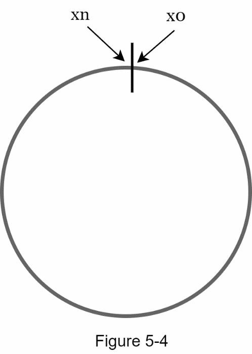

import InterviewQuestion from "@site/src/components/InterviewQuestion";

# Chapter 5: Design Consistent Hashing

:::note
Consistent hashing is a key technique in distributed systems to ensure minimal data movement when servers are added or removed.
:::

## The Rehashing Problem

- **Common Way and Problem**

  - If you have n cache servers, a common way to balance the load is to use the following hash method:
    `serverIndex = hash(key) % N`, where N is the size of the server pool.
  - **EX:** serverIndex = hash(key) % 4
    

  - **Problem:** If server 1 goes offline and we re-distribute? (ex:hash for key0, key1, key2, key3 = 9, 0, 10, 8...)
    

  → Since the modulo base changes from 4 to 3, **most of the keys are reassigned to different servers**, not just the ones originally mapped to server 1. This leads to a large number of **cache misses**!

  > **Cache Misses**:  
  > A cache miss occurs when the data requested by a system is not found in the cache, so the system has to fetch the data from a slower, underlying source, such as a database or remote server, increasing **latency** and reducing **performance**.

  | Operation | 0   | 1   | 2   | 3   | 4   | 5   | 6   | 7   | 8   | 9   | 10  | 11  | 12  |
  | --------- | --- | --- | --- | --- | --- | --- | --- | --- | --- | --- | --- | --- | --- |
  | key % 4   | 0   | 1   | 2   | 3   | 0   | 1   | 2   | 3   | 0   | 1   | 2   | 3   | 0   |
  | key % 3   | 0   | 1   | 2   | 0   | 1   | 2   | 0   | 1   | 2   | 0   | 1   | 2   | 0   |

## Consistent hashing

- **Hash space and hash ring**

  - The concept of **consistent hashing** maps all hash values onto a **circular space**, also called a **hash ring**.
  - Using a hash function like **SHA-1**, the output range of the hash function `f` spans from `0` to `2¹⁶⁰ - 1`, forming a complete hash space.
  - In this example: - `x0 = 0` - `xn = 2¹⁶⁰ - 1` - All hash values fall within this range and are treated as **positions on the ring**.
    

- **Hash Servers**

  - Next, we hash each server’s IP or name using the same hash function `f`, and **map each server onto the hash ring**.
  - Each server is placed at a position on the ring, and it becomes responsible for all keys that fall between **its position and the next server in the clockwise direction**.
  - In the example, four servers (`server0` to `server3`) are mapped onto the ring.
  - Each point `s0` to `s3` on the ring represents the hash result of the corresponding server.
    

- **Hash Keys**

  - Instead of using modulo (`%`) like traditional hashing, consistent hashing maps both servers and keys onto a circular hash ring.
  - In the example, 4 cache keys (`key0`, `key1`, `key2`, `key3`) are hashed onto the ring using a hash function, such as SHA-1.
  - This avoids the rehashing problem because there is **no modular operation**, and key placement depends on its position on the ring.
    

- **Server Lookup**

  - To determine which server a key maps to, we go **clockwise** from the key’s position on the ring until a server is found.
  - In the example:
    - `key0` → `server0`
    - `key1` → `server1`
    - `key2` → `server2`
    - `key3` → `server3`
      

- **Add a Server!!**

  - Using consistent hashing, **only a small portion of keys need to be reassigned** when a new server is added.
  - In the diagram (Figure 5‑8), `server 4` is added to the hash ring.
  - Previously, `key0` was mapped to `server 0`.
  - After the new server is added, `key0` now maps to `server 4` (the next node in the clockwise direction).
    - ✅ Only `key0` is redistributed.
    - ✅ Other keys (`key1`, `key2`, `key3`) stay on their original servers.
      

- **Remove a Server!!**
  - When a server is removed, **only the keys that map to it need to be reassigned**.
  - In the diagram (Figure 5‑9), `server 1` is removed.
  - `key1`, which originally mapped to `server 1`, must now be remapped.
  - It goes to the next server in the clockwise direction — `server 2`.
    - ✅ Only `key1` is reassigned.
    - ✅ All other keys are unaffected.
  - This efficient redistribution is one of the core benefits of **consistent hashing**.
    

---

## Two Issues in the Basic Consistent Hashing Approach

- **Issue 1: Uneven Partition Size After Server Removal**

  - When a server is removed, the partition (hash range between adjacent servers) may become uneven.
  - In **Figure 5-10**, `server 1 (s1)` is removed. As a result, `server 2 (s2)` takes over the entire space between `s0` and `s2`, which is **twice as large** as the space of `s0` and `s3`.
  - This creates a **load imbalance** because some servers are responsible for much larger key ranges than others.
    

- **Issue 2: Non-Uniform Key Distribution**
  - Even if the partition size is balanced, key distribution may still be skewed.
  - In **Figure 5-11**, although 4 servers (`s0` to `s3`) are placed on the ring, most keys fall into the range of `server 2 (s2)`. Servers `s1` and `s3` hold **no data at all**.
  - This happens because the **positions of servers on the ring are not evenly spaced**, causing some servers to receive almost all the traffic.
    

---

## Virtual Nodes in Consistent Hashing

A **virtual node** refers to a logical representation of a real server. Each server is mapped to **multiple positions** on the hash ring to improve **load balancing**.

- **Why Use Virtual Nodes?**

  - Real servers (e.g., `server 0`, `server 1`) are represented by multiple **virtual nodes** (e.g., `s0_0`, `s0_1`, `s0_2`).
  - This ensures a **more uniform distribution** of keys, even if servers are unevenly spaced.
    

- **Key Lookup with Virtual Nodes**

  1. Move **clockwise** from the key's hash position.
  2. Select the **first virtual node** encountered.
  3. That virtual node maps to a real server.
     

- **Balanced Load Distribution**

  - As the **number of virtual nodes increases**, key distribution becomes **more even**.
  - Standard deviation of load:
    - ~10% with 100 virtual nodes
    - ~5% with 200 virtual nodes
  - **Trade-off**: More virtual nodes = better balance, but higher metadata/storage overhead.

---

## Find Affected Keys in Consistent Hashing

When a server is **added** or **removed**, a portion of the key space must be redistributed.

- **Adding a Server**

  1. Start from **`s4`** (newly added server)
  2. Move **anticlockwise** around the ring
  3. Stop at the next encountered server (**`s3`**)
  4. Keys between **`s3`** and **`s4`** are reassigned to **`s4`**
     

- **Removing a Server**
  1. Start from **`s1`**
  2. Move **anticlockwise** until reaching **`s0`**
  3. Keys between **`s0`** and **`s1`** must be reassigned to **`s2`**
     

---

## Wrap Up: Consistent Hashing Summary

In this chapter, we explored consistent hashing in depth — its necessity and how it works.

- **Benefits of Consistent Hashing**

  - **Minimized key redistribution** when servers are added or removed.
  - **Horizontal scalability** is easy because data is more evenly distributed.
  - **Hotspot mitigation**: Prevents overload on a single shard.
    - e.g., Imagine Katy Perry, Justin Bieber, and Lady Gaga all being routed to one server — that’s a problem!
    - Virtual Nodes helps spread such hot keys more evenly.

- **Real-World Use Cases**
  - Amazon DynamoDB (Partitioning component)
  - Apache Cassandra (Data partitioning across the cluster)
  - Discord (Chat application)
  - Akamai (Content Delivery Network)
  - Maglev (Google’s network load balancer)

---

## Content Review

<InterviewQuestion
  level="junior"
  question="What is a hash ring in consistent hashing?"
  hint="It involves circular structure..."
  answer="A hash ring is a circular representation of the hash space, where both keys and servers are hashed onto the ring. It enables consistent key assignment and minimal key movement when nodes change."
/>

<InterviewQuestion
  level="junior"
  question="What is the main issue with using `hash(key) % N` for server selection in distributed systems?"
  hint="Consider what happens when N changes."
  answer="When the number of servers (N) changes, the modulo base changes, causing most keys to be reassigned. This leads to high cache miss rates and performance degradation."
/>

<InterviewQuestion
  level="junior"
  question="Why does consistent hashing minimize the number of keys that need to be remapped when a server is added or removed?"
  hint="Think about how keys are assigned in a circular space and how only a small range is affected."
  answer="In consistent hashing, both keys and servers are mapped to a circular hash ring. When a server is added, only the keys that fall between the new server and its predecessor are remapped. This localized redistribution minimizes disruption compared to traditional modulo-based hashing."
/>

<InterviewQuestion
  level="mid"
  question="How do you find the server responsible for a given key in a consistent hash ring?"
  hint="Move in one direction along the ring..."
  answer="To find the server for a key, hash the key to a point on the ring, then move clockwise until a server position is found. That server is responsible for the key."
/>

<InterviewQuestion
  level="mid"
  question="In a consistent hash ring, what happens when a server is removed? How is key reassignment handled?"
  hint="Trace the ring in the anticlockwise direction to identify which range is affected."
  answer="When a server is removed, the keys previously assigned to it are reassigned to the next server in the clockwise direction. The affected key range is identified by moving anticlockwise from the removed server until reaching the previous live server."
/>

<InterviewQuestion
  level="mid"
  question="How do we determine which keys are affected when adding a new server to the hash ring?"
  hint="Start from the new server and look backward."
  answer="Start from the new server's position and move anticlockwise until the previous server is found. All keys in this range are reassigned to the new server."
/>

<InterviewQuestion
  level="mid"
  question="Why can removing a server from the consistent hash ring cause load imbalance?"
  hint="Think about partition size between neighbors."
  answer="If a server is removed and its neighbors are unevenly spaced, the next server may inherit a much larger key range, leading to load imbalance. This is especially problematic without virtual nodes."
/>

<InterviewQuestion
  level="senior"
  question="How do virtual nodes help solve the uneven key distribution problem in consistent hashing?"
  hint="Focus on how key distribution changes when each server has multiple positions on the ring."
  answer="Virtual nodes distribute each physical server’s load across multiple positions on the hash ring, reducing variance caused by uneven spacing of server hashes. This leads to a more uniform distribution of keys and better load balancing."
/>

<InterviewQuestion
  level="senior"
  question="What trade-offs are introduced when increasing the number of virtual nodes per server?"
  hint="More balance vs. more cost."
  answer="Increasing virtual nodes improves key distribution and load balancing but also increases metadata size and lookup overhead. It may also complicate server failure recovery and management."
/>
