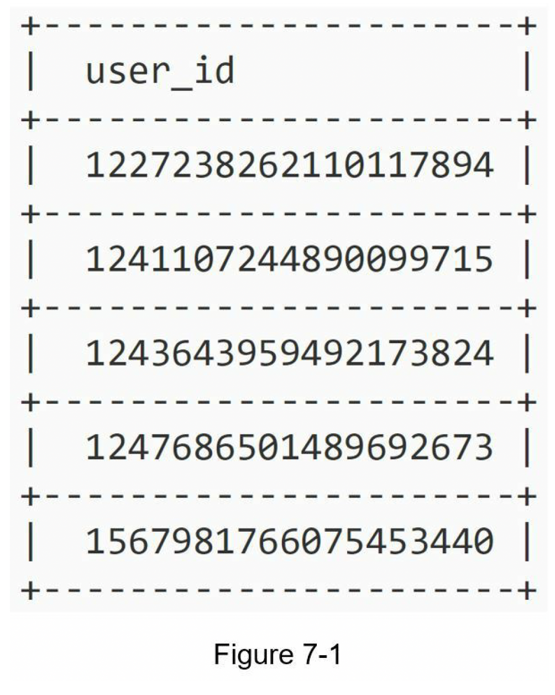
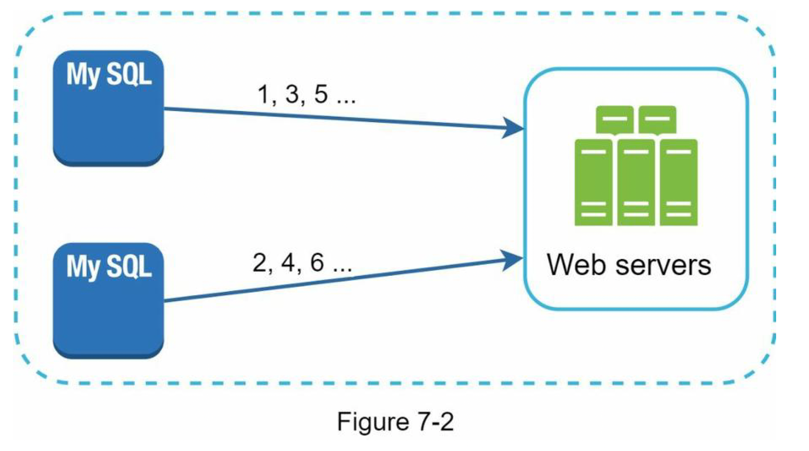
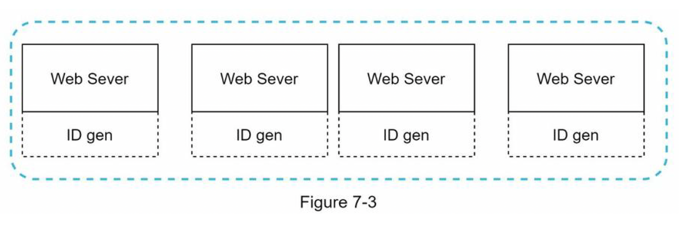
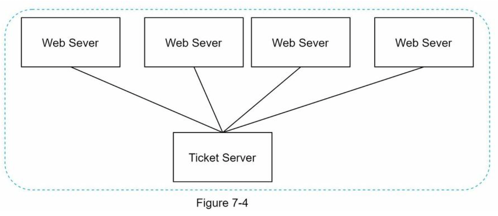
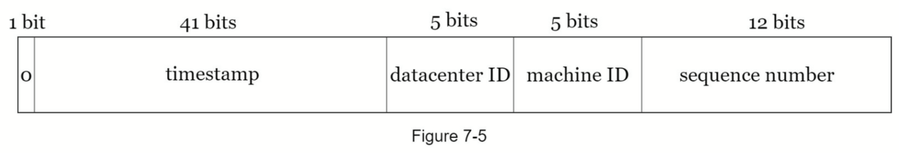
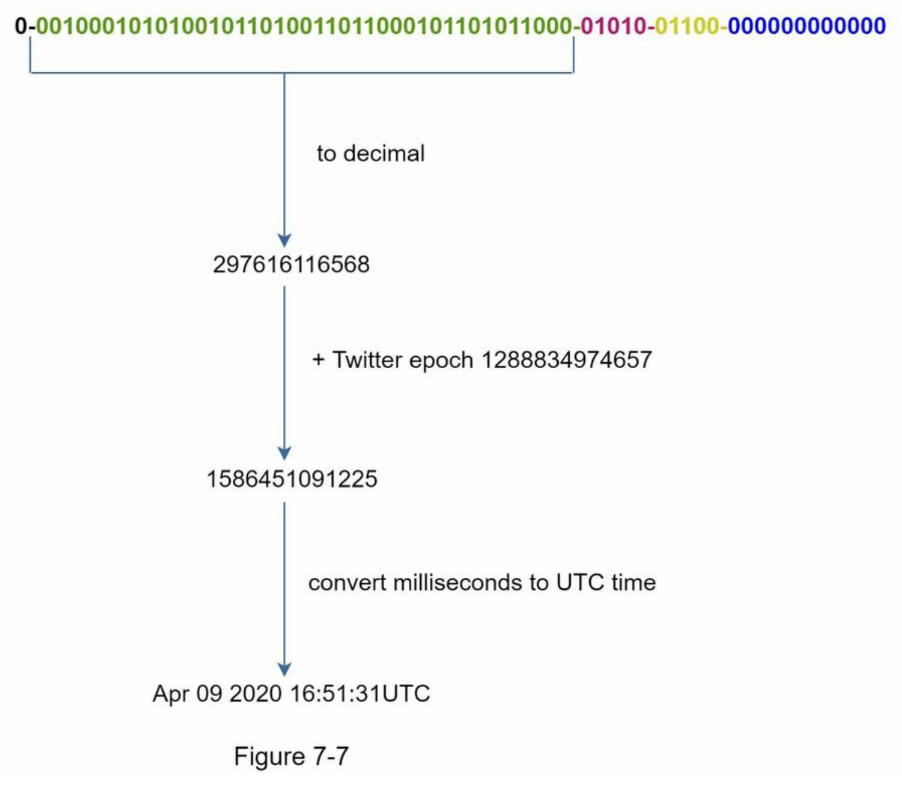

import InterviewQuestion from "@site/src/components/InterviewQuestion";

# Chapter 7: Design a Unique ID Generator in Distributed Systems

:::note
You are asked to design a unique ID generator in distributed systems.
:::

## First thought
> Using a primary key with the `auto_increment` attribute in a traditional
database
- Does not work in a distributed environment because
  1. a single database server is not large enough
  2. generating unique IDs across multiple databases with minimal delay is challenging
  

## Step 1 - Understand the problem and establish design scope
- **Clarification questions**
  - **Candidate**: What are the characteristics of unique IDs?
  - **Interviewer**: IDs must be unique and sortable.
  - **Candidate**: For each new record, does ID increment by 1?
  - **Interviewer**: The ID increments by time but not necessarily only increments by 1. IDs
  created in the evening are larger than those created in the morning on the same day.
  - **Candidate**: Do IDs only contain numerical values?
  - **Interviewer**: Yes, that is correct.
  - **Candidate**: What is the ID length requirement?
  - **Interviewer**: IDs should fit into 64-bit.
  - **Candidate**: What is the scale of the system?
  - **Interviewer**: The system should be able to generate 10,000 IDs per second.
- **the requirements are listed as follows**
  - IDs must be unique.
  - IDs are numerical values only.
  - IDs fit into 64-bit.
  - IDs are ordered by date.
  - Ability to generate over 10,000 unique IDs per second.

## Step 2 - Propose high-level design and get buy-in
- **Multi-master replication**
  
  - uses the databases’ `auto_increment` feature
  - increasing the next ID by `1`, we increase it by `k`
  - where k is the number of database servers in use
  - ✅ Pros:
    - solves some scalability issues because IDs can scale with the number of database servers.
  - ❌ Cons:
    - Hard to scale with multiple data centers
    - IDs do not go up with time across multiple servers.
    - It does not scale well when a server is added or removed

- **UUID**
  - UUID is a `128-bit` number used to identify information in computer systems. e.g. `09c93e62-50b4-468d-bf8a-c07e1040bfb2`
  
  - ✅ Pros:
    - low probability of getting collusion
    - UUIDs can be
  generated independently without coordination between servers
    > after generating 1 billion UUIDs every second for approximately
  100 years would the probability of creating a single duplicate reach 50%”
    - The system is easy to scale 
      - because each web server is responsible for generating IDs they consume. 
      - ID generator can easily scale with web servers.
  - ❌ Cons:
    - IDs are 128 bits long, but our requirement is 64 bits.
    - IDs do not go up with time.
    - IDs could be non-numeric.

- **Ticket Server**
  - The idea is to use a centralized auto_increment feature in a single database server
    
    - ✅ Pros:
      - Numeric IDs.
      - It is easy to implement, and it works for small to medium-scale applications.
    - ❌ Cons:
      - Single point of failure
      - To avoid a single point of failure  →  we can set up
multiple ticket servers  →  will introduce new challenges such as data
synchronization.

- **Twitter snowflake approach**
  - Twitter’s unique ID generation system called “snowflake” is inspiring and can satisfy our requirements.
  - Divide and conquer  →  Instead of generating an ID directly  → we divide an ID into different sections
  - the layout of a `64-bit` ID
    
  - Sign bit: `1 bit`. It will always be `0`. This is reserved for future uses. It can potentially be used to distinguish between signed and unsigned numbers.
  - Timestamp: `41 bits`. Milliseconds since the epoch or custom epoch. We use Twitter snowflake default epoch `1288834974657`, equivalent to `Nov 04, 2010, 01:42:54 UTC`.
  - Datacenter ID: `5 bits`, which gives us `2 ^ 5 = 32` datacenters.
  - Machine ID: `5 bits`, which gives us `2 ^ 5 = 32` machines per datacenter.
  - Sequence number: `12 bits`. For every ID generated on that machine/process, the sequence number is incremented by `1`. The number is reset to `0` every millisecond.

## Step 3 - Design deep dive
- Fixed: Datacenter IDs and machine ID
  - Any changes in datacenter IDs and machine IDs require careful review
since an accidental change in those values can lead to ID conflicts.

- **Timestamp**
  - `41 bits`
  - are sortable by time
  - binary representation is converted to UTC
  
  - The maximum timestamp that can be represented in `41 bits` is
`2 ^ 41 - 1 = 2199023255551 milliseconds (ms)`, which gives us: `~ 69 years =
2199023255551 ms / 1000 seconds / 365 days / 24 hours/ 3600 seconds`
  - This means the ID generator will work for 69 years 
  - and having a custom epoch time close to today’s date delays the overflow time 
  - After 69 years, we will need a new epoch time or adopt other techniques
to migrate IDs.

- **Sequence number**
  - `12 bits`
  - 2 ^ 12 = 4096 combinations.
  - This field is `0` unless more than one ID is generated in a millisecond on the same server

## Step 4 - Wrap up
 - **unique ID generator**
  - multimaster replication
  - UUID
  - ticket server
  - Twitter snowflake-like unique ID generator
- **a few additional talking points:**
  -  **Clock synchronization**
    - we assume ID generation servers have the same clock
    - might not be true when a server is running on multiple cores and multi-machine scenarios
    - ✅ popular solution: Network Time Protocol
  - **Section length tuning**
    - e.g. fewer sequence numbers but more timestamp bits are effective for low concurrency and long-term applications
  - **High availability**
    - Since an ID generator is a mission-critical system, it must be highly
available