import InterviewQuestion from "@site/src/components/InterviewQuestion";

# Chapter 8: Design A URL Shortener

:::note
Designing a URL shortening service like tinyurl
:::

## Step 1 - Understand the problem and establish design scope
- **Clarification questions**
  - **Candidate**: Can you give an example of how a URL shortener work?
  - **Interviewer**: Assume URL `https://www.systeminterview.com/q=chatsystem&c=loggedin&v=v3&l=long` is the original URL. Your service creates an alias with shorter length: `https://tinyurl.com/ y7keocwj`. If you click the alias, it redirects you to the original URL.
  - **Candidate**: What is the traffic volume?
  - **Interviewer**: `100 million` URLs are generated per day.
  - **Candidate**: How long is the shortened URL?
  - **Interviewer**: As short as possible.
  - **Candidate**: What characters are allowed in the shortened URL?
  - **Interviewer**: Shortened URL can be a combination of numbers `(0-9)` and characters `(a-z, AZ)`.
  - **Candidate**: Can shortened URLs be deleted or updated?
  - **Interviewer**: For simplicity, let us assume shortened URLs cannot be deleted or updated.
  - **Here are the basic use cases**:
    1. URL shortening: given a long URL => return a much shorter URL
    2. URL redirecting: given a shorter URL => redirect to the original URL
    3. High availability, scalability, and fault tolerance considerations
- **Back of the envelope estimation**
  - Write operation: 100 million URLs are generated per day.
  - Write operation per second: 100 million / 24 /3600 = 1160
  - Read operation: Assuming ratio of read operation to write operation is 10:1, read operation per second: 1160 * 10 = 11,600
  - Assuming the URL shortener service will run for 10 years, this means we must support 100 million * 365 * 10 = 365 billion records.
  - Assume average URL length is 100 bytes.
  - Storage requirement over 10 years: 365 billion * 100 bytes * 10 years = 365 TB

## Step 2 - Propose high-level design and get buy-in
- **API Endpoints**
  - API REST-style
    1. URL shortening. To create a new short URL, a client sends a POST request, which contains one parameter: the original long URL. The API looks like this:
      - `POST api/v1/data/shorten`
        - request parameter: `{longUrl: longURLString}`
        - return shortURL
    2. URL redirecting. To redirect a short URL to the corresponding long URL, a client sends a GET request. The API looks like this:
      - `GET api/v1/shortUrl`
        - Return longURL for HTTP redirection
- **URL redirecting**
  - Once the server receives a tinyurl request, it changes the short URL to the long URL with 301 redirect.
  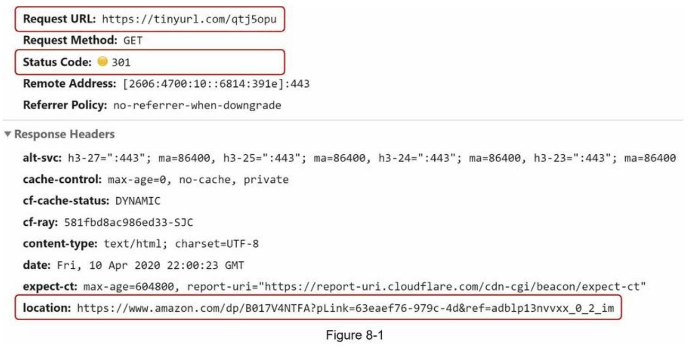
  - The detailed communication between clients and servers
  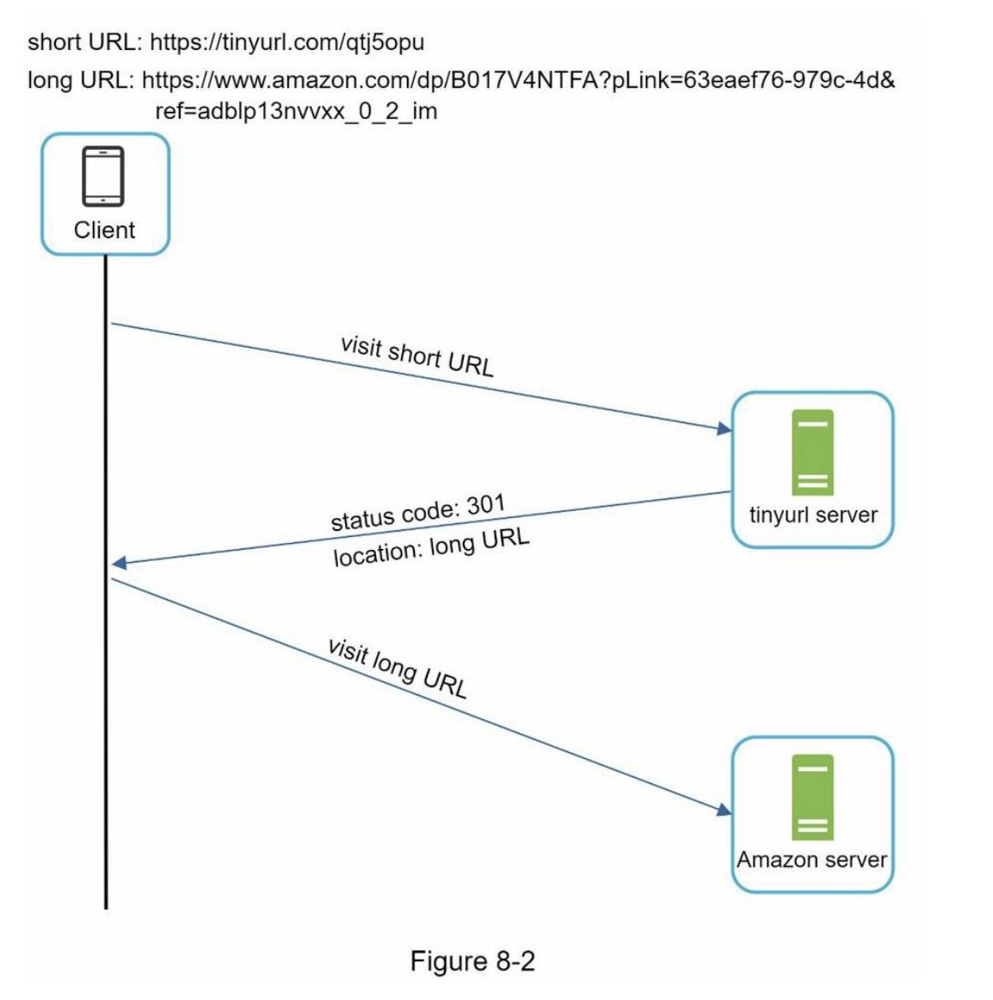
  -  301 redirect vs 302 redirect
      - 301 redirect
        - shows that the requested URL is “permanently” moved to the long URL
        - the browser caches the response, and subsequent requests for the same URL will not be sent to the URL shortening service
        - requests are redirected to the long URL server directly
        - ✅ Pros:
          -  If the priority is to reduce the server load, using 301 redirect makes sense as only the first request of the same URL is sent to URL shortening servers.
      - 302 redirect
        - the URL is “temporarily” moved to the long URL
        - subsequent requests for the same URL will be sent to the URL shortening service first. Then, they are redirected to the long URL server
        - ✅ Pros:
          - if analytics is important, 302 redirect is a better choice as it can track click rate and source of the click more easily
  - Using hash tables
      - Assuming the hash table stores `<shortURL, longURL>` pairs
      - Get longURL: longURL = hashTable.get(shortURL)
      - Once you get the longURL, perform the URL redirect.

- **URL shortening**
  - assume the short URL looks like this: `www.tinyurl.com/{hashValue}`
  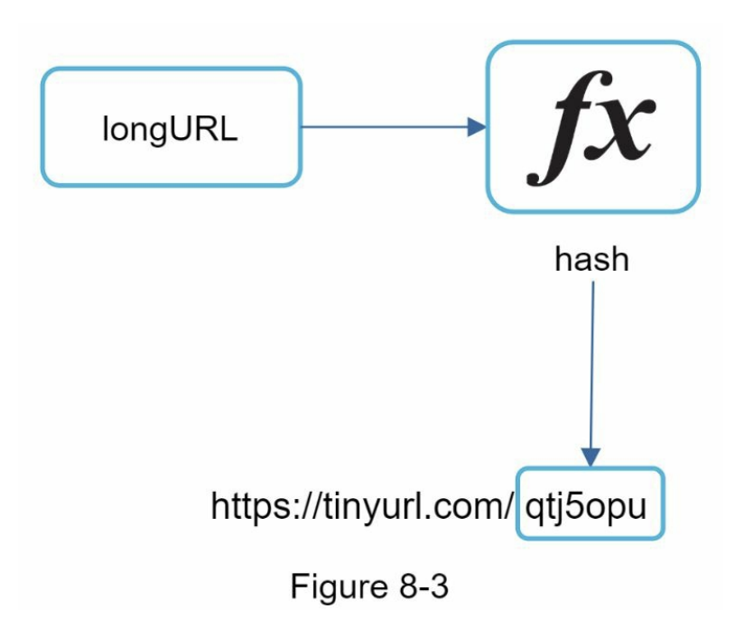
  - The hash function must satisfy the following requirements:
    - Each longURL must be hashed to one hashValue.
    - Each hashValue can be mapped back to the longURL.

## Step 3 - Design deep dive

- **Data model**
  - ❌ everything is stored in a hash table → not feasible for real-world systems → memory resources are limited and expensive
  - ✅ to store `<shortURL, longURL>` mapping in a relational database
  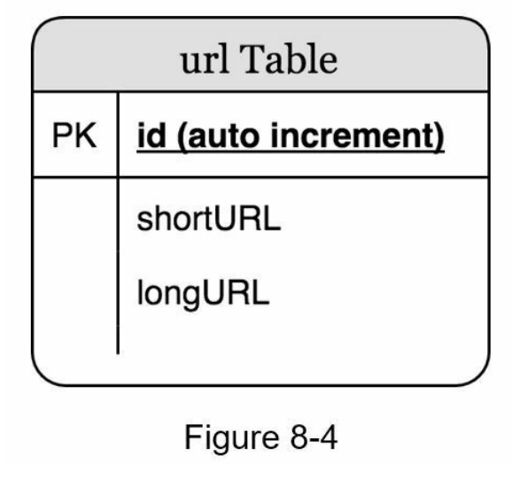

- **Hash function**
  - to hash a long URL to a short URL
  - **Hash value length**
    - `[0-9, a-z, A-Z]`, containing `10 + 26 + 26 = 62` possible characters
    - based on the back of the envelope estimation → find the smallest `n` such that `62^n ≥ 365 billion`
    - When `n = 7`, `62 ^ n = ~3.5 trillion`, `3.5 trillion` is more than enough to hold `365 billion` URLs, so the length of hashValue is `7`
    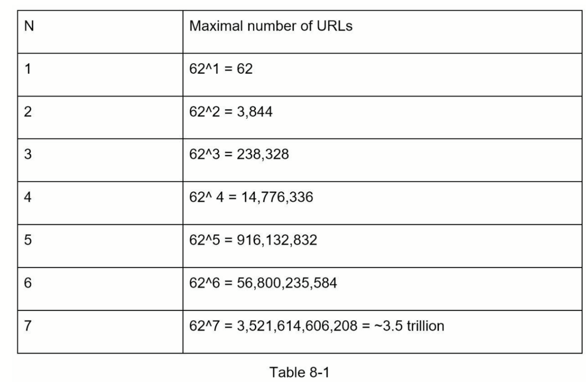
  - **Hash + collision resolution**
    - a hash function that hashes a long URL to a 7-character string
    - well-known hash functions
    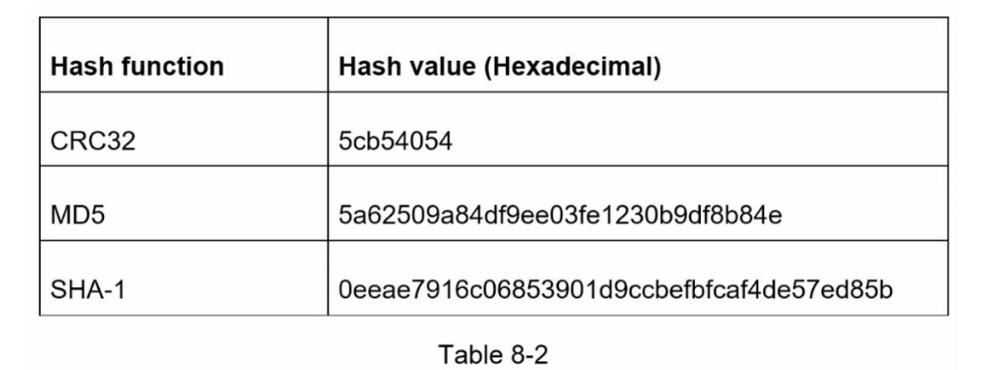
    - even the shortest hash value (from CRC32) is too long (more than 7
characters)
    - How can we make it shorter?
      - ❌ to collect the first 7 characters of a hash value → hash collisions
      - ✅ To resolve hash collisions
        - recursively append a new predefined string until no more collision is discovered
        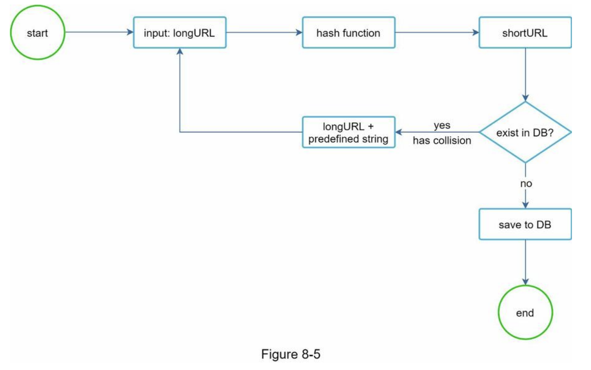
      - ✅ Pros:
        - eliminate collision
      - ❌ Cons:
        - it is expensive to query the database to check if a shortURL exists for every request. 
      - 💡Improve performance:
        - `bloom filters`
          -  a space-efficient probabilistic technique to test if an element is a member of a set
  - **Base 62 conversion**
    - helps to convert the same number between its different number representation systems
    - 62 possible characters for hashValue
    - 62 characters for encoding. The mappings are:
      - `0-0`, ..., `9-9`, `10-a`, `11-b`, ..., `35-z`, `36-A`, ..., `61-Z`, where `a` stands for `10`, `Z` stands for `61`, etc.
    - example: 11157 10 to base 62 representation
      - 1115710 = 2 x 622 + 55 x 621 + 59 x 620 = [2, 55, 59] → [2, T, X] in base 62 representation
      -  the short URL is https://tinyurl.com /**2TX**
      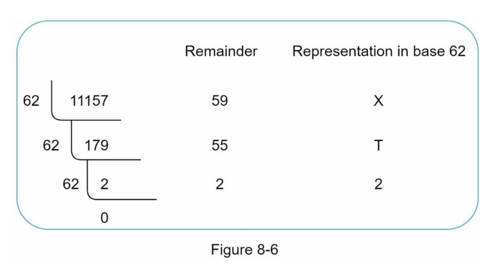

  - Comparison of the two approaches
    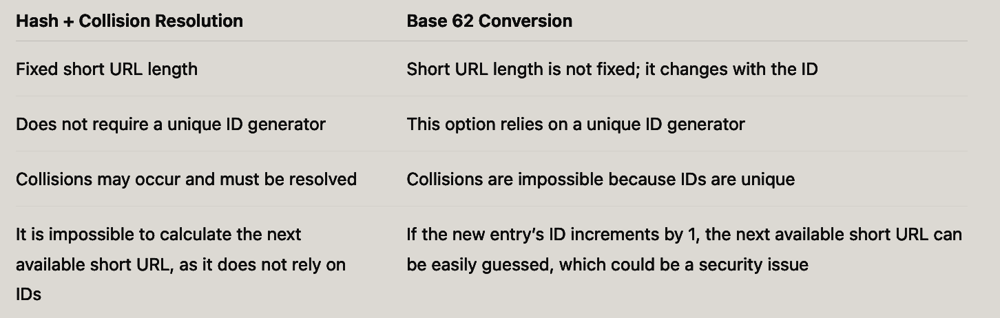
  

## URL shortening deep dive
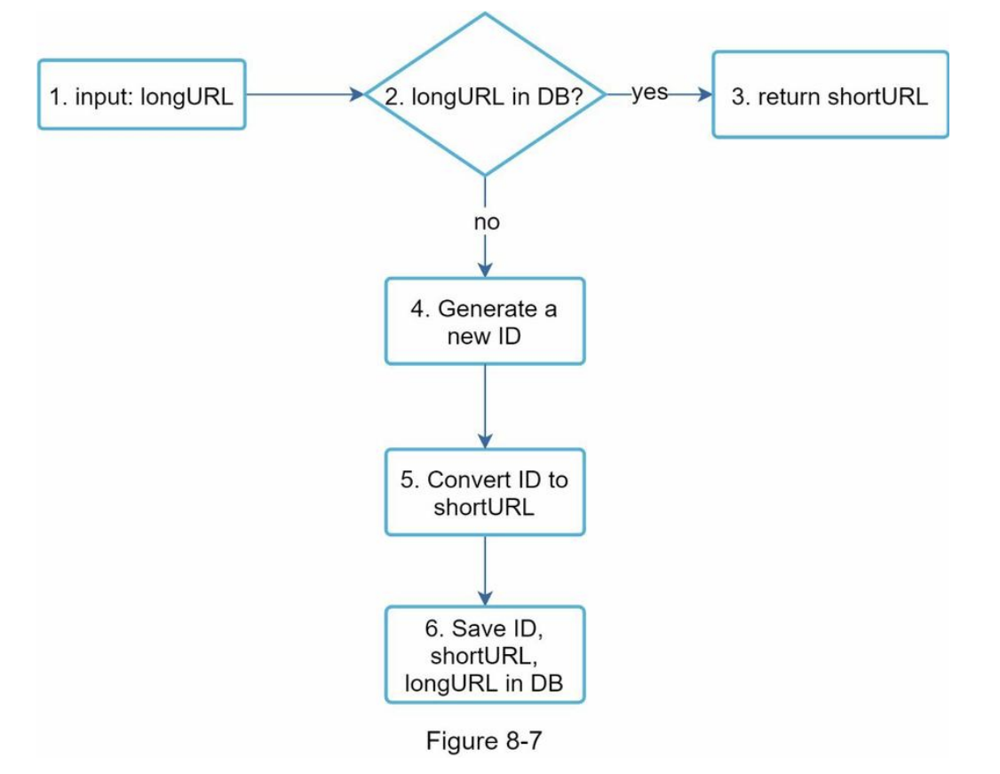
-  a concrete example:
  - Assuming the input longURL is: `https://en.wikipedia.org/wiki/Systems_design`
  - Unique ID generator returns ID: `2009215674938`.
  - Convert the ID to shortURL using the base 62 conversion. `ID (2009215674938)` is converted to `zn9edcu`.
  - Save ID, shortURL, and longURL to the database as shown in Table 8-4
  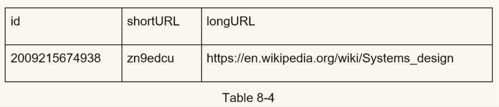

## URL redirecting deep dive
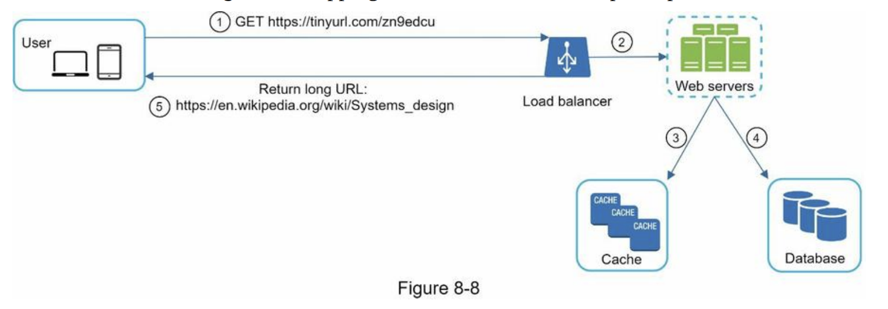
- The flow of URL redirecting is summarized as follows:
  1. A user clicks a short URL link: https://tinyurl.com/zn9edcu
  2. The load balancer forwards the request to web servers.
  3. If a shortURL is already in the cache, return the longURL directly.
  4. If a shortURL is not in the cache, fetch the longURL from the database. If it is not in the
  database, it is likely a user entered an invalid shortURL.
  5. The longURL is returned to the user.

## Step 4 - Wrap up
- API design, data model, hash function, URL shortening, and URL redirecting.
- a few additional talking points:
  - Rate limiter: 
    - overwhelmingly large number of URL shortening requests
    - Rate limiter helps to filter out requests based on IP address or other filtering rules
  - Web server scaling
  - Database scaling
  - Analytics:
    - how many people click on a link? When do they click the link? etc.
  - Availability, consistency, and reliability