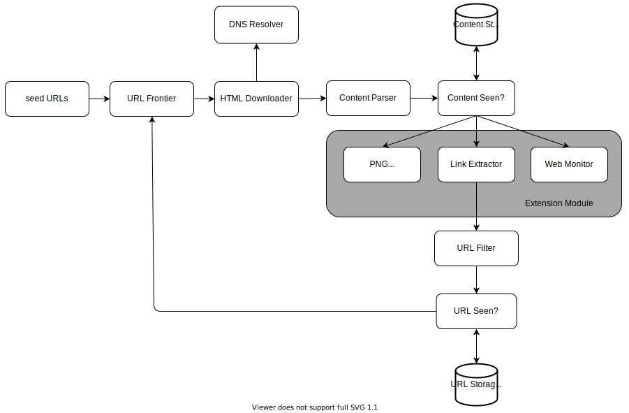

# Chapter 9: Design a Web Crawler

:::note

What is a web crawler?

A web crawler (also known as a robot or spider) is used by search engines to discover new or updated content on the web.

The basic algorithm is:

1. Given a set of URLs, download the web pages.

2. Extract URLs from these pages.

3. Add new URLs to the list to be downloaded and repeat.

Characteristics of web crawlers:

- Scalability: Must be extremely efficient using parallelization to handle the web's massive size.

- Robustness: Must handle web traps like bad HTML, unresponsive servers, and malicious links.

- Politeness: Should not make too many requests to a website within a short time interval.

- Extensibility: Should be flexible so minimal changes are needed to support new content types.

:::

## Establish Design Scope

This phase clarifies the system's requirements and constraints. The main points derived from the Q&A with the interviewer are:

**Key Requirements**

- Purpose: Search engine indexing.

- Scale: Crawl 1 billion web pages per month.

- Content Type: HTML only.

- Freshness: The crawler must consider newly added or edited web pages.

- Storage: Store crawled HTML pages for up to 5 years.

- Deduplication: Pages with duplicate content should be ignored.

**Back-of-the-envelope Estimation**

The main points derived from the Q&A with the interviewer are:

- QPS (Queries Per Second)

1,000,000,000 pages / 30 days / 24 hours / 3600 seconds ≈ 400 QPS 

Peak QPS is estimated at 2 * QPS = 800 QPS.

- Storage

1 billion pages * 500k/page = 500 TB per month. (*Assuming an average page size of 500k*)

Total storage for 5 years: 500 TB/month * 12 months * 5 years = 30 PB.

## High-Level Architecture & Workflow

### High-Level Architecture

This is a breakdown of the main building blocks of the web crawler.

- **Seed URLs**: The initial set of URLs that the crawler uses as a starting point.

- **URL Frontier**: Stores the URLs that are yet to be downloaded. Acts as the manager for the crawler's "to-do list".

- **HTML Downloader**: Fetches the raw HTML content of a web page from the internet.

- **DNS Resolver**: Translates a website's hostname (e.g., en.wikipedia.org) into an IP address.

- **Content Parser**: Parses the downloaded HTML to extract its structure and ensure it's not malformed.

- **Content Seen?**: Checks if the exact same content has been seen before (from a different URL) to prevent storing duplicates. Usually works by comparing hashes.

- **Content Storage**: The storage system (e.g., a database or a distributed file system) that holds the content of downloaded pages.

- **URL Extractor**: Extracts all hyperlink URLs from a downloaded HTML page.

- **URL Filter**: Filters out unwanted or irrelevant links based on predefined rules (e.g., file extensions, blacklisted sites).

- **URL Seen?**: A data structure (like a Bloom filter or hash table) that tracks if a URL has already been processed or is currently in the frontier to prevent redundant work and infinite loops.

- **URL Storage**: Stores all URLs that have already been visited.

### Workflow

This is the step-by-step process showing how a URL is processed through the system.

1. **Start**: Add seed URLs to the URL Frontier.

2. **Fetch**: The HTML Downloader gets a list of URLs from the URL Frontier.

3. **Download**: The downloader gets the IP address from the DNS Resolver and downloads the page.

4. **Parse**: The downloaded page is sent to the Content Parser.

5. **Check Content Duplicates**: The parsed content is checked by "Content Seen?".

6. **Discard or Process**: If the content is a duplicate, it's discarded. If it's new, it's sent to the URL Extractor.

7. **Extract Links**: The URL Extractor pulls all links from the page content.

8. **Filter Links**: The extracted links are passed to the URL Filter.

9. **Check URL Duplicates**: The filtered links are checked by "URL Seen?".

10. **Discard or Add**: If a URL has already been visited or is in the frontier, it's discarded.

11. **Add to Frontier**: If the URL is new, it's added to the URL Frontier for future crawling. The cycle repeats.

## Deep Dive into Key Components and Challenges

### DFS vs. BFS

You can think of the web as a massive, directed graph. Crawling is essentially a graph traversal problem.

- **DFS (Depth-First Search)**: Generally not a good choice. A crawler using DFS could easily get stuck in a very deep "rabbit hole" within a single website (e.g., domain.com/a/b/c/...).

- **BFS (Breadth-First Search)**: Commonly used by web crawlers. It explores the web layer by layer. The URL Frontier is essentially a large-scale, sophisticated implementation of a BFS queue.

### The URL Frontier
 

 A simple FIFO queue for BFS is not enough. A well-designed URL Frontier must handle:
 
 #### Politeness
 
 - Problem: A single queue may batch many URLs from the same host, causing bursty, impolite traffic.
 - Design (Back queues model):
   - Create multiple queues, one per host.
   - A "Queue Router" assigns each URL to its host-specific queue.
   - Worker threads consume from one host at a time with a configurable delay between requests.
 
 #### Priority
 
 - Problem: Not all pages are equally important; FIFO has no notion of importance.
 - Design (Front queues model):
   - A Prioritizer assigns a score (e.g., PageRank, traffic).
   - Maintain multiple queues (f1, f2, ..., fn) by priority level.
   - A "Queue Selector" favors higher-priority queues when pulling work.

 #### Freshness
 
 - Problem: Web pages change frequently; recrawling everything uniformly is too slow and expensive.
 - Design:
   - Re-crawl pages based on estimated update frequency.
   - Prioritize important pages to be re-crawled more often.
 
 #### Storage
 
 - Problem: The frontier can contain hundreds of millions of URLs; RAM is insufficient and disk I/O can bottleneck.
 - Design (Hybrid approach):
   - Keep the majority of URLs on disk.
   - Use fast in-memory buffers for enqueue/dequeue, flushing to disk periodically.

### The HTML Downloader

The HTML Downloader is responsible for the actual network requests to fetch web pages. Its design involves a balance between performance and respecting website rules.

#### Robots Exclusion Protocol (robots.txt)

- What it is: robots.txt is a standard file that websites use to communicate with crawlers. It specifies which parts of the site crawlers are allowed or disallowed to access.
- Rule: A polite crawler must check a site's robots.txt file before crawling it and strictly follow its rules.
- Optimization: Cache robots.txt per host and refresh it periodically to avoid fetching on every request.

#### Performance and Reliability

- Distributed crawl: Distribute crawl jobs across multiple servers; each handles a subset of the URL space (horizontal scaling).

- Cache DNS resolver: Maintain a local DNS cache to avoid the 10–200ms lookup penalty on every request.
- Locality: Place crawl servers near target regions to reduce network latency and speed up downloads.
- Short timeout: Enforce a maximum wait time; if a server does not respond within the timeout, abandon the request and move on.

### Robustness

A large-scale distributed system must be designed to be resilient to failures.

#### Techniques

- Consistent hashing: Distribute load (e.g., URLs) evenly across downloader servers to simplify scale out/in without massive rebalancing.
- Checkpoint crawl state: Periodically persist system state (e.g., URL Frontier) so a disrupted crawl can resume from the last checkpoint.
- Graceful exception handling: Handle frequent errors (network failures, malformed HTML) without crashing the system.
- Data validation: Validate inputs and intermediate data to prevent propagation of malformed data.

### Extensibility

The system should be flexible enough to support new content types and features in the future without a complete redesign.

#### Design Approach

- Pluggable modules: Add capabilities without redesign (e.g., a PNG Downloader, or a Web Monitor for copyright checks).

### Detect and Avoid Problematic Content

The web is messy. The crawler must be able to handle redundant, meaningless, or harmful content.

#### Problems

- Duplicate content: Nearly 30% of web content is duplicated.
- Spider traps: Servers can generate infinite paths (e.g., .../foo/bar/foo/bar/...).
- Low-value noise: Ads, code snippets, or spam provide little value.

#### Mitigations

- Hash/checksum-based deduplication to detect and discard duplicates.
- Set a maximum URL length to avoid traps; ignore URLs exceeding the limit.
- Filter and exclude low-value content where possible.

## Further Considerations

This final section covers advanced topics and other important aspects for building a production-ready web crawler.

#### Server-side Rendering (SSR)

- Problem: Many modern websites generate links dynamically with JavaScript or AJAX, which a simple HTML downloader cannot discover.
- Solution: Perform server-side or dynamic rendering before parsing to execute page scripts and obtain the final HTML with all generated links.

#### Filter Unwanted Pages

- Rationale: Storage and crawl budget are finite; avoid low-quality content.
- Approach: Use an anti-spam/quality component to identify and filter spam or low-value pages so resources focus on meaningful content.

#### Data Layer: Replication and Sharding

- Replication: Create database copies to improve availability and read scalability.
- Sharding: Partition data across databases to scale writes and storage.
- Goal: Increase availability, scalability, and reliability of the data layer.

#### Horizontal Scaling

- Run on hundreds or thousands of servers.
- Design crawling servers to be stateless to enable elastic scaling and simplified operations.

#### Availability, Consistency, and Reliability

- Core concerns for any large system; evaluate trade-offs and apply them across components.

#### Analytics

- Collect and analyze telemetry to monitor crawler health and performance.
- Use insights from analytics to tune system behavior and improve efficiency.

